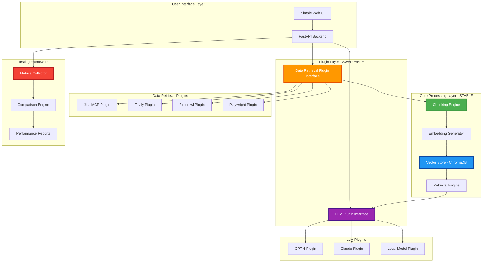
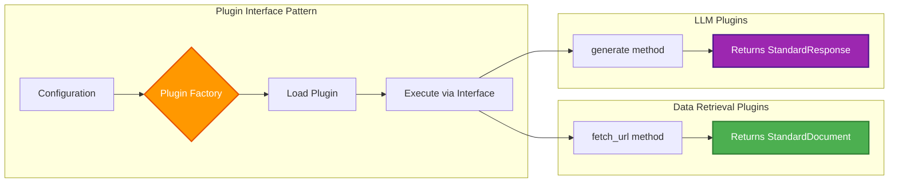
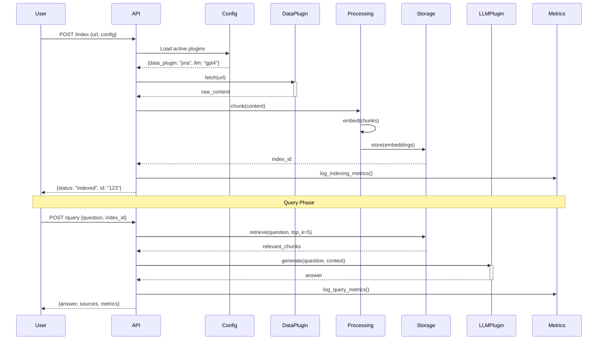
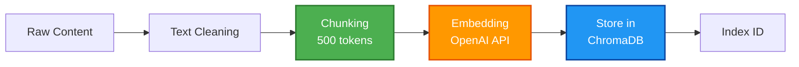
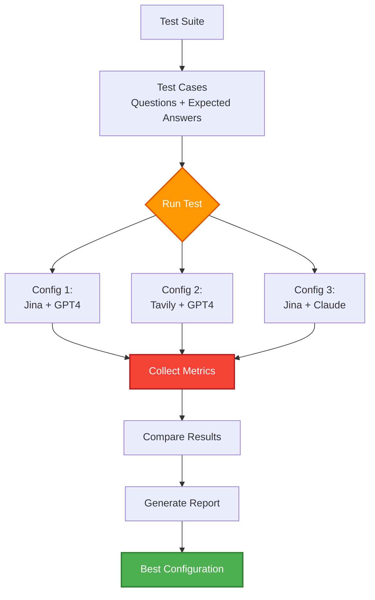
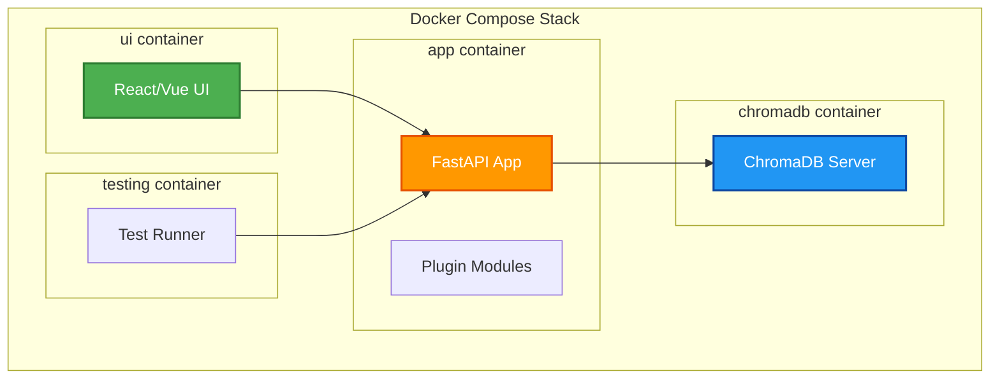
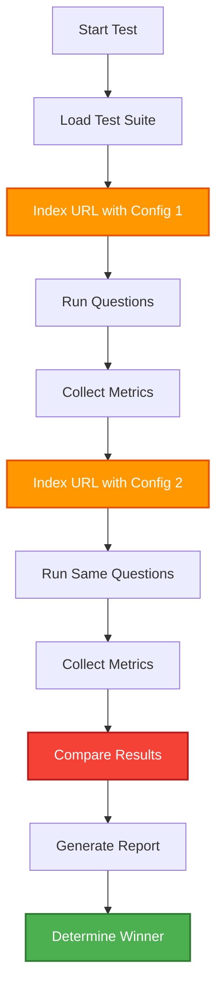

# Website RAG System - Modular Implementation Plan

## What We're Building

### Understanding the Requirements

Based on our brainstorming session, I understand we are building:

**A modular, plugin-based RAG system that allows experimentation with different components to scientifically determine the best approach for answering questions about website content.**

### Core Workflow
```
URL Input → Data Retrieval → Processing → Storage → Query → Answer Generation
```

### Key Design Principles

1. **Swappable Architecture**: Any component can be replaced without touching other parts
2. **Containerized**: Everything runs in Docker for consistency
3. **API-Driven**: RESTful endpoints for all operations
4. **Testable**: Built-in metrics and comparison framework
5. **UI-Accessible**: Simple web interface for interaction

---

## System Architecture

### High-Level Component View



---

## Detailed Architecture

### 1. Plugin Interface Design

The system has **two primary plugin points**:



### 2. Data Flow Architecture



---

## Component Specifications

### Component 1: Data Retrieval Plugin Interface

**Purpose**: Fetch and extract content from URLs with swappable implementations

**Interface Definition**:
```python
from abc import ABC, abstractmethod
from dataclasses import dataclass
from typing import List, Dict, Optional

@dataclass
class StandardDocument:
    """Standardized document format all plugins must return"""
    url: str
    content: str  # Clean markdown/text
    metadata: Dict
    timestamp: str
    source_plugin: str

class DataRetrievalPlugin(ABC):
    """Base interface all data retrieval plugins must implement"""

    @abstractmethod
    def fetch_url(self, url: str) -> StandardDocument:
        """Fetch and process a single URL"""
        pass

    @abstractmethod
    def fetch_batch(self, urls: List[str]) -> List[StandardDocument]:
        """Fetch multiple URLs (optional optimization)"""
        pass

    @abstractmethod
    def get_capabilities(self) -> Dict:
        """Return plugin capabilities (supports_js, rate_limit, etc.)"""
        pass
```

**Implementations**:

1. **JinaMCPPlugin**
   - Uses Jina MCP `read_url` tool
   - Supports parallel processing via `parallel_read_url`
   - Free tier with API key

2. **TavilyPlugin**
   - Uses Tavily search API
   - Intelligent content discovery
   - Paid service

3. **FirecrawlPlugin**
   - Professional web scraping
   - Full site crawling
   - Paid service

4. **PlaywrightPlugin**
   - DIY browser automation
   - Full control
   - Free but slower

**Configuration Example**:
```yaml
data_retrieval:
  active: "jina"  # Switch to "tavily", "firecrawl", "playwright"

  jina:
    api_key: ${JINA_API_KEY}
    use_parallel: true
    max_batch_size: 10

  tavily:
    api_key: ${TAVILY_API_KEY}
    search_depth: "advanced"

  playwright:
    headless: true
    timeout: 30000
```

---

### Component 2: LLM Plugin Interface

**Purpose**: Generate answers with swappable models and prompts

**Interface Definition**:
```python
@dataclass
class StandardResponse:
    """Standardized response format"""
    answer: str
    sources: List[str]
    confidence: float
    model_used: str
    tokens_used: int

class LLMPlugin(ABC):
    """Base interface for LLM plugins"""

    @abstractmethod
    def generate(
        self,
        question: str,
        context: List[str],
        prompt_template: Optional[str] = None
    ) -> StandardResponse:
        """Generate answer from question and context"""
        pass

    @abstractmethod
    def get_model_info(self) -> Dict:
        """Return model information (name, cost, limits)"""
        pass
```

**Implementations**:

1. **GPT4Plugin**
   - OpenAI GPT-4
   - High quality, paid

2. **ClaudePlugin**
   - Anthropic Claude
   - Alternative to GPT-4

3. **LocalModelPlugin**
   - Open-source models
   - Free, private

**Configuration Example**:
```yaml
llm:
  active: "gpt4"  # Switch to "claude", "local"

  gpt4:
    api_key: ${OPENAI_API_KEY}
    model: "gpt-4-turbo-preview"
    temperature: 0.7
    max_tokens: 1000

  prompts:
    system: "You are a helpful assistant..."
    user_template: "Answer based on context: {context}\n\nQuestion: {question}"
```

---

### Component 3: Core Processing Pipeline (Stable)

**Purpose**: Standard processing regardless of plugins



**Components**:
- **Chunker**: Markdown-based semantic chunking
- **Embedder**: OpenAI text-embedding-3-small
- **Vector Store**: ChromaDB persistent storage

---

### Component 4: Testing & Comparison Framework

**Purpose**: Compare different plugin combinations scientifically



**Metrics Collected**:
1. **Indexing Metrics**:
   - Time to fetch content
   - Content quality (word count, completeness)
   - Cost per page
   - Error rate

2. **Query Metrics**:
   - Answer accuracy (compared to ground truth)
   - Response time
   - Token usage
   - Cost per query
   - Relevance score

3. **Quality Metrics**:
   - BLEU score (answer similarity)
   - Human evaluation ratings
   - Source attribution accuracy

**Comparison Output**:
```json
{
  "test_run_id": "2025-01-15-001",
  "configurations_tested": [
    {
      "name": "jina_gpt4",
      "data_plugin": "jina",
      "llm_plugin": "gpt4",
      "metrics": {
        "avg_answer_accuracy": 0.87,
        "avg_response_time": 2.3,
        "total_cost": 0.45,
        "error_rate": 0.02
      }
    },
    {
      "name": "tavily_gpt4",
      "data_plugin": "tavily",
      "llm_plugin": "gpt4",
      "metrics": {
        "avg_answer_accuracy": 0.92,
        "avg_response_time": 3.1,
        "total_cost": 0.89,
        "error_rate": 0.01
      }
    }
  ],
  "winner": "tavily_gpt4",
  "winner_reason": "Best accuracy despite higher cost"
}
```

---

## Docker Architecture



**docker-compose.yml Structure**:
```yaml
version: '3.8'

services:
  api:
    build: ./api
    ports:
      - "8000:8000"
    env_file:
      - .env
    volumes:
      - ./config:/app/config
      - ./plugins:/app/plugins
    depends_on:
      - chromadb

  chromadb:
    image: chromadb/chroma:latest
    ports:
      - "8001:8000"
    volumes:
      - chroma_data:/chroma/chroma

  ui:
    build: ./ui
    ports:
      - "3000:3000"
    environment:
      - REACT_APP_API_URL=http://localhost:8000

  testing:
    build: ./testing
    volumes:
      - ./test_results:/app/results
    depends_on:
      - api

volumes:
  chroma_data:
```

---

## API Endpoints Design

### Indexing Endpoints

**POST /api/v1/index**
```json
Request:
{
  "url": "https://bizgenieai.com",
  "config_name": "jina_gpt4",  // Uses pre-defined config
  "options": {
    "force_refresh": false
  }
}

Response:
{
  "index_id": "uuid-123",
  "status": "completed",
  "metrics": {
    "pages_indexed": 15,
    "time_taken": 45.2,
    "cost": 0.12
  }
}
```

**GET /api/v1/index/{index_id}/status**
```json
Response:
{
  "index_id": "uuid-123",
  "status": "completed",
  "progress": 100,
  "documents_count": 15
}
```

---

### Query Endpoints

**POST /api/v1/query**
```json
Request:
{
  "index_id": "uuid-123",
  "question": "What services does BizGenie offer?",
  "config_name": "jina_gpt4"
}

Response:
{
  "answer": "BizGenie offers AI automation services...",
  "sources": [
    {
      "url": "https://bizgenieai.com/services",
      "snippet": "Our services include..."
    }
  ],
  "confidence": 0.92,
  "metrics": {
    "response_time": 2.3,
    "tokens_used": 450,
    "cost": 0.02
  }
}
```

---

### Configuration Endpoints

**GET /api/v1/configs**
```json
Response:
{
  "configs": [
    {
      "name": "jina_gpt4",
      "data_plugin": "jina",
      "llm_plugin": "gpt4",
      "active": true
    },
    {
      "name": "tavily_gpt4",
      "data_plugin": "tavily",
      "llm_plugin": "gpt4",
      "active": false
    }
  ]
}
```

**PUT /api/v1/configs/{config_name}/activate**
```json
Response:
{
  "config_name": "tavily_gpt4",
  "status": "activated"
}
```

---

### Testing Endpoints

**POST /api/v1/test/run**
```json
Request:
{
  "test_suite": "customer_support_qa",
  "configs_to_test": ["jina_gpt4", "tavily_gpt4"],
  "test_url": "https://bizgenieai.com"
}

Response:
{
  "test_run_id": "test-001",
  "status": "running",
  "eta_seconds": 300
}
```

**GET /api/v1/test/{test_run_id}/results**
```json
Response:
{
  "test_run_id": "test-001",
  "status": "completed",
  "results": {
    "winner": "tavily_gpt4",
    "detailed_metrics": {...}
  }
}
```

---

## Project Structure

```
website-rag/
├── docker-compose.yml
├── .env.example
├── README.md
├── IMPLEMENTATION.md
├── PLAN.md
│
├── api/                           # FastAPI backend
│   ├── Dockerfile
│   ├── requirements.txt
│   ├── main.py
│   ├── app/
│   │   ├── __init__.py
│   │   ├── api/
│   │   │   ├── v1/
│   │   │   │   ├── endpoints/
│   │   │   │   │   ├── index.py
│   │   │   │   │   ├── query.py
│   │   │   │   │   ├── config.py
│   │   │   │   │   └── testing.py
│   │   ├── core/
│   │   │   ├── config.py         # Configuration management
│   │   │   ├── plugin_factory.py # Plugin loading system
│   │   ├── plugins/
│   │   │   ├── base.py           # Abstract base classes
│   │   │   ├── data_retrieval/
│   │   │   │   ├── jina.py
│   │   │   │   ├── tavily.py
│   │   │   │   ├── firecrawl.py
│   │   │   │   └── playwright.py
│   │   │   ├── llm/
│   │   │   │   ├── gpt4.py
│   │   │   │   ├── claude.py
│   │   │   │   └── local.py
│   │   ├── services/
│   │   │   ├── chunking.py
│   │   │   ├── embedding.py
│   │   │   ├── storage.py
│   │   │   └── retrieval.py
│   │   ├── testing/
│   │   │   ├── test_runner.py
│   │   │   ├── metrics.py
│   │   │   └── comparison.py
│   │   └── models/
│   │       ├── documents.py
│   │       └── responses.py
│
├── ui/                            # React/Vue frontend
│   ├── Dockerfile
│   ├── package.json
│   ├── src/
│   │   ├── components/
│   │   │   ├── IndexForm.tsx
│   │   │   ├── QueryForm.tsx
│   │   │   ├── ConfigSwitcher.tsx
│   │   │   └── TestRunner.tsx
│   │   ├── pages/
│   │   │   ├── Index.tsx
│   │   │   ├── Query.tsx
│   │   │   └── Testing.tsx
│   │   └── App.tsx
│
├── config/                        # Configuration files
│   ├── configs.yaml              # Plugin configurations
│   ├── test_suites/
│   │   └── customer_support_qa.json
│
├── tests/                         # Integration tests
│   ├── test_plugins.py
│   ├── test_api.py
│   └── test_pipeline.py
│
└── scripts/                       # Utility scripts
    ├── setup.sh
    └── run_comparison.sh
```

---

## Implementation Phases

### Phase 1: Core Infrastructure (Week 1)

**Goal**: Set up foundation and plugin architecture

**Tasks**:
1. Create project structure
2. Set up Docker compose
3. Implement base plugin interfaces
4. Create configuration management system
5. Set up ChromaDB connection
6. Build basic FastAPI skeleton

**Deliverables**:
- Docker containers running
- Plugin factory working
- Configuration loading functional

---

### Phase 2: Jina Plugin Implementation (Week 1-2)

**Goal**: First working plugin for data retrieval

**Tasks**:
1. Implement `JinaMCPPlugin`
2. Integrate with Jina MCP server
3. Implement chunking service
4. Implement embedding service
5. Implement storage service
6. Create `/index` endpoint

**Deliverables**:
- Can index bizgenieai.com via Jina
- Content stored in ChromaDB
- API endpoint working

**Test**:
```bash
curl -X POST http://localhost:8000/api/v1/index \
  -H "Content-Type: application/json" \
  -d '{"url": "https://bizgenieai.com", "config_name": "jina_gpt4"}'
```

---

### Phase 3: GPT-4 Plugin & Query Pipeline (Week 2)

**Goal**: Complete query functionality

**Tasks**:
1. Implement `GPT4Plugin`
2. Implement retrieval service
3. Create `/query` endpoint
4. Build context assembly logic
5. Integrate LLM generation

**Deliverables**:
- Can answer questions about indexed content
- Full pipeline working (index → query → answer)

**Test**:
```bash
curl -X POST http://localhost:8000/api/v1/query \
  -H "Content-Type: application/json" \
  -d '{
    "index_id": "uuid-123",
    "question": "What does BizGenie do?",
    "config_name": "jina_gpt4"
  }'
```

---

### Phase 4: Additional Plugins (Week 2-3)

**Goal**: Add alternative plugins for comparison

**Tasks**:
1. Implement `TavilyPlugin`
2. Implement `ClaudePlugin` (or another LLM)
3. Create configuration switching mechanism
4. Test plugin swapping

**Deliverables**:
- Can switch between Jina and Tavily
- Can switch between GPT-4 and Claude
- Configuration endpoint working

---

### Phase 5: Testing Framework (Week 3)

**Goal**: Automated comparison system

**Tasks**:
1. Create test suite format
2. Implement metrics collector
3. Build comparison engine
4. Create `/test/run` endpoint
5. Generate comparison reports

**Deliverables**:
- Can run automated tests
- Metrics collected and stored
- Comparison reports generated

**Test Suite Example**:
```json
{
  "name": "customer_support_qa",
  "test_cases": [
    {
      "question": "What services does BizGenie offer?",
      "expected_keywords": ["automation", "AI", "services"],
      "difficulty": "easy"
    },
    {
      "question": "How do I get started with BizGenie?",
      "expected_keywords": ["contact", "demo", "signup"],
      "difficulty": "medium"
    }
  ]
}
```

---

### Phase 6: UI Development (Week 3-4)

**Goal**: User-friendly interface

**Tasks**:
1. Create index page (URL input, config selector)
2. Create query page (question input, answer display)
3. Create config switcher
4. Create test runner page
5. Add results visualization

**Deliverables**:
- Web UI accessible at http://localhost:3000
- Can perform all operations via UI
- Shows metrics and comparisons

---

### Phase 7: Polish & Documentation (Week 4)

**Goal**: Production-ready system

**Tasks**:
1. Add error handling
2. Add logging
3. Write API documentation
4. Create user guide
5. Add example configurations
6. Performance optimization

**Deliverables**:
- Robust error handling
- Complete documentation
- Ready for real testing

---

## Configuration Management

### configs.yaml
```yaml
# Active configuration
active_config: "jina_gpt4"

# Available configurations
configurations:
  jina_gpt4:
    name: "Jina + GPT-4"
    description: "Free data retrieval with premium LLM"
    data_retrieval:
      plugin: "jina"
      api_key: ${JINA_API_KEY}
      options:
        use_parallel: true
        batch_size: 10
    llm:
      plugin: "gpt4"
      api_key: ${OPENAI_API_KEY}
      options:
        model: "gpt-4-turbo-preview"
        temperature: 0.7

  tavily_gpt4:
    name: "Tavily + GPT-4"
    description: "AI-powered discovery with premium LLM"
    data_retrieval:
      plugin: "tavily"
      api_key: ${TAVILY_API_KEY}
      options:
        search_depth: "advanced"
        include_raw_content: true
    llm:
      plugin: "gpt4"
      api_key: ${OPENAI_API_KEY}
      options:
        model: "gpt-4-turbo-preview"
        temperature: 0.7

  jina_claude:
    name: "Jina + Claude"
    description: "Free data retrieval with Anthropic LLM"
    data_retrieval:
      plugin: "jina"
      api_key: ${JINA_API_KEY}
    llm:
      plugin: "claude"
      api_key: ${ANTHROPIC_API_KEY}
      options:
        model: "claude-3-opus-20240229"

# Processing settings (stable across configs)
processing:
  chunking:
    strategy: "markdown"
    chunk_size: 500
    chunk_overlap: 50

  embedding:
    provider: "openai"
    model: "text-embedding-3-small"

  storage:
    type: "chromadb"
    persist_directory: "/app/data/chromadb"
```

---

## Testing Strategy

### Test Execution Flow



### Metrics to Track

| Metric Category | Specific Metrics | Purpose |
|----------------|------------------|---------|
| **Performance** | Response time, throughput | Speed comparison |
| **Quality** | Answer accuracy, relevance score | Effectiveness |
| **Cost** | API costs, token usage | Economics |
| **Reliability** | Error rate, uptime | Stability |
| **Content** | Completeness, freshness | Data quality |

---

## Success Criteria

### System is ready when:

✅ **Functional Requirements**:
- [ ] Can index a website URL
- [ ] Can answer questions about indexed content
- [ ] Can switch between plugins via config
- [ ] Can run automated comparison tests
- [ ] Has working UI for all operations

✅ **Non-Functional Requirements**:
- [ ] All services run in Docker
- [ ] API responds in < 3 seconds
- [ ] Supports at least 2 data retrieval plugins
- [ ] Supports at least 2 LLM plugins
- [ ] Generates comparison reports

✅ **Testing Requirements**:
- [ ] Can compare Jina vs Tavily
- [ ] Can compare different LLMs
- [ ] Metrics are collected and stored
- [ ] Reports are readable and actionable

---

## Next Steps

Once this implementation plan is approved:

1. **Review & Approve**: Ensure this matches your vision
2. **Environment Setup**: Set up API keys, Docker
3. **Phase 1 Start**: Build core infrastructure
4. **Iterative Development**: Build phase by phase
5. **Testing**: Run comparisons as we build

---

## Questions for Clarification

Before we start implementation, please confirm:

1. **Docker preferences**: Any specific Docker setup requirements?
2. **UI framework**: React, Vue, or simple HTML?
3. **API keys**: Do you already have Jina/OpenAI/Tavily keys?
4. **Testing focus**: Which metrics matter most to you?
5. **Timeline**: Is 4 weeks reasonable or do we need to adjust?

---

**This document serves as our implementation blueprint. Once approved, we proceed to Phase 1.**
