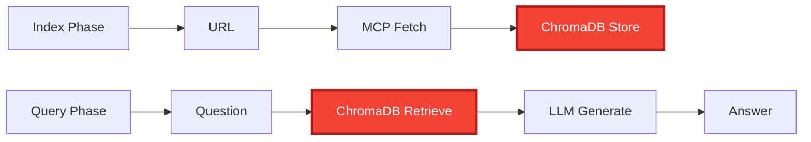
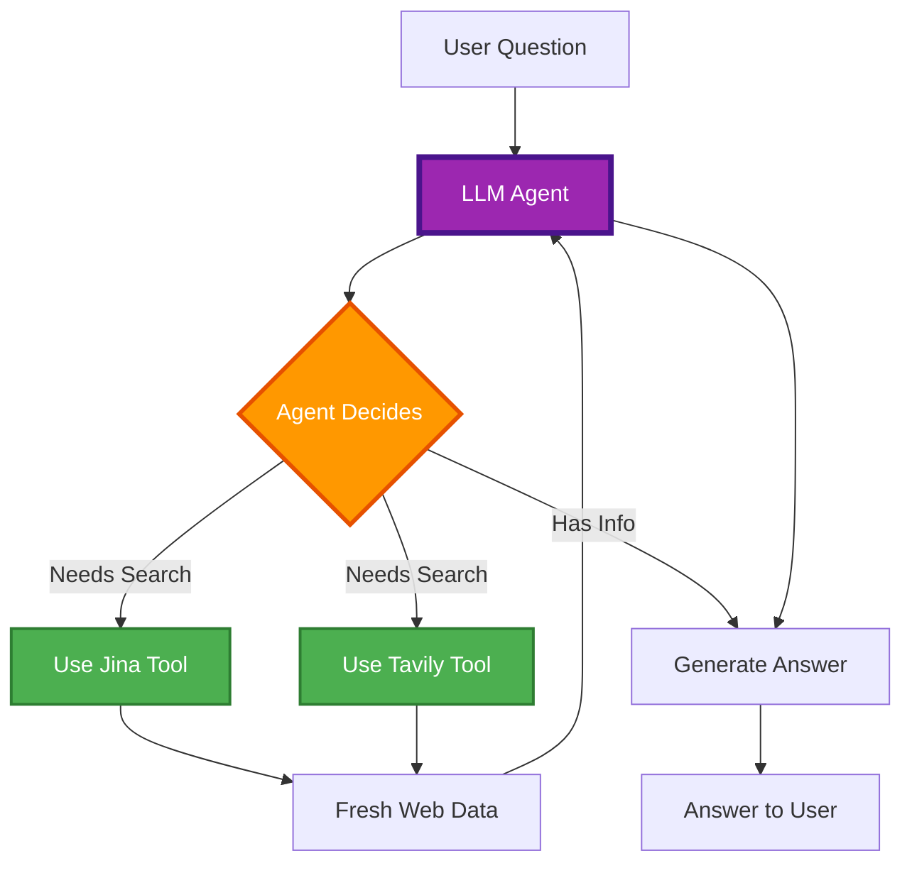
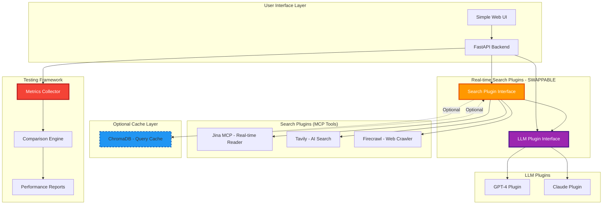
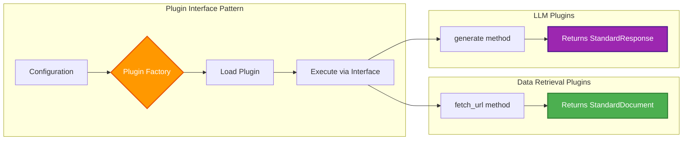
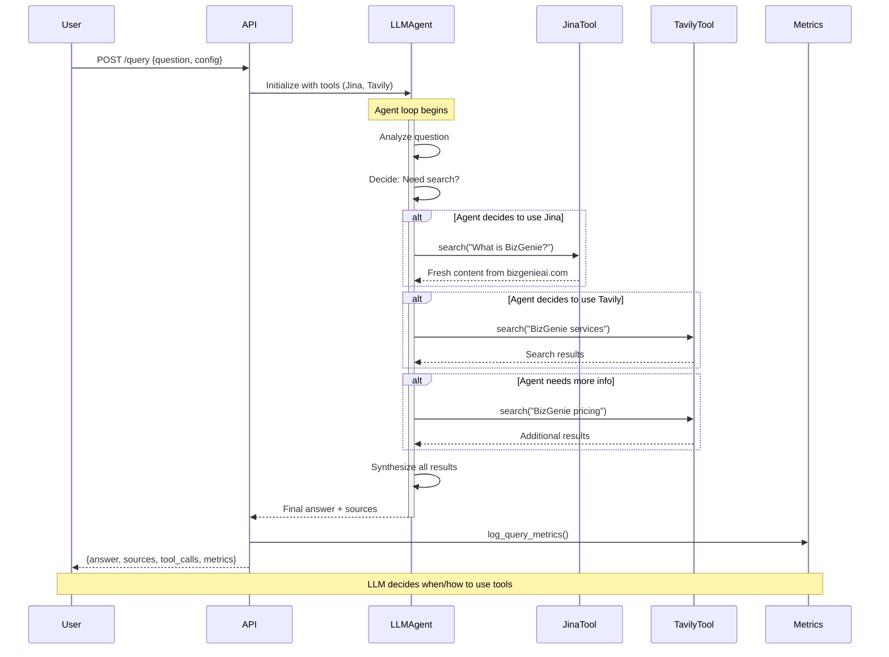
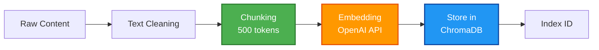
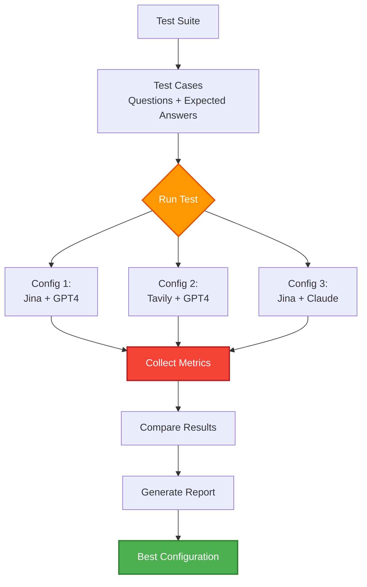
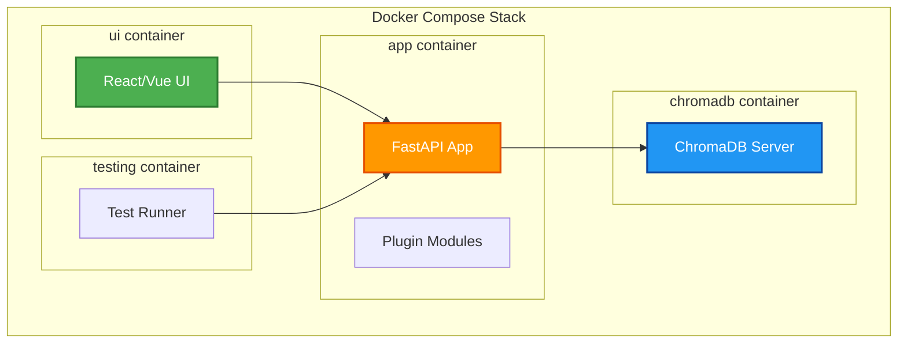
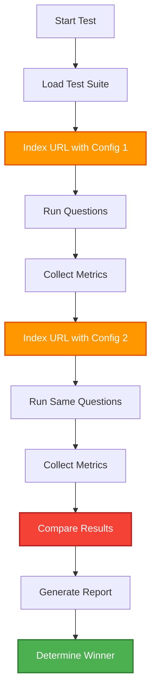

# Website RAG System - Modular Implementation Plan

## ⚠️ ARCHITECTURAL UPDATE (2025-01-26)

**IMPORTANT: The original implementation was WRONG for our use case.**

### What We're Actually Building

**A real-time, Perplexity-style search chatbot that uses MCP tools to answer questions with fresh web data.**

**NOT** a static knowledge base. **NOT** a traditional RAG system with pre-indexed content.

### Core Workflow (CORRECTED)
```
REAL-TIME APPROACH (What we want):
User Question → MCP Tool Search (Jina/Tavily) → Fresh Web Data → LLM → Answer

NOT THIS (Old wrong approach):
URL Input → Data Retrieval → Storage → Query → Answer Generation
```

### Key Design Principles

1. **Real-time Search**: MCP tools fetch fresh data for each query (not pre-indexed)
2. **Swappable Architecture**: Any MCP or LLM can be replaced without touching other parts
3. **Containerized**: Everything runs in Docker for consistency
4. **API-Driven**: RESTful endpoints for all operations
5. **Testable**: Built-in metrics and comparison framework (comparing MCP+LLM combinations)
6. **Perplexity-style**: Each query triggers fresh web search, not static database lookup

---

## Architecture Comparison: Old vs New

### ❌ OLD APPROACH (Static RAG - WRONG)



**Problems:**
- MCP tools only used during indexing
- Queries read from stale ChromaDB data
- Not real-time, not dynamic
- Wrong for Perplexity-style search

---

### ✅ NEW APPROACH (Agentic Real-time Search - CORRECT)



**Agentic Benefits:**
- **LLM has agency**: Decides when/how to use tools
- **Multi-tool usage**: Can use Jina AND Tavily if needed
- **Iterative search**: Can search multiple times if initial results insufficient
- **Context-aware**: LLM formulates search queries based on conversation
- **Tool calling**: Uses Claude/GPT function calling
- **Matches Perplexity/NotebookLLM**: They use agentic LLMs too!

---

## System Architecture (CORRECTED)

### High-Level Component View



**Key Changes:**
- MCP tools renamed to "Search Plugins" (more accurate)
- ChromaDB moved to optional cache layer (dotted lines)
- Single query flow, no separate indexing phase
- Real-time search on every request

---

## Detailed Architecture

### 1. Plugin Interface Design

The system has **two primary plugin points**:



### 2. Data Flow Architecture (CORRECTED for Agentic Real-time)



**Key Differences from Old Approach:**
- ❌ No separate indexing phase
- ✅ **LLM is in control** (not a pipeline)
- ✅ Agent decides which tools to use
- ✅ Can use multiple tools per query
- ✅ Iterative refinement possible
- ✅ Tool calling via Claude/GPT function calling

---

## Component Specifications

### Agentic Architecture Explained

**What does "agentic" mean?**

Instead of a fixed pipeline (User → Search → LLM), the **LLM is in control**:

1. **LLM receives question** and available tools (Jina, Tavily)
2. **LLM decides** if it needs to search
3. **LLM formulates** search queries
4. **LLM uses tools** via function calling
5. **LLM synthesizes** results into answer

**Example Flow:**

```
User: "What does BizGenie offer and how much does it cost?"

LLM thinks: "I need to search for BizGenie info"
LLM calls: jina_search("What is BizGenie")
→ Gets: Content about BizGenie services

LLM thinks: "I have service info, but need pricing"
LLM calls: tavily_search("BizGenie pricing")
→ Gets: Pricing information

LLM thinks: "Now I have everything"
LLM responds: "BizGenie offers [services] and pricing is [prices]"
```

**Implementation Approaches:**

1. **Claude with Tool Use** (Recommended)
   - Native tool calling support
   - Excellent at deciding when to use tools
   - Can use multiple tools in sequence

2. **OpenAI Function Calling**
   - GPT-4 native function calling
   - Similar to Claude tool use

3. **LangChain Agents**
   - Framework for building agents
   - More complex but flexible

**What We'll Build:**
- Tools are exposed to LLM as functions
- LLM calls them as needed
- We execute the tool calls
- Return results to LLM
- LLM continues reasoning

---

### Component 1: Tool Interface (for Agentic LLM)

**Purpose**: Provide search capabilities as tools that LLM agents can call

**Tool Definition for LLM**:
```python
# How the tool is exposed to Claude/GPT-4
jina_search_tool = {
    "name": "jina_search",
    "description": "Search and read content from websites using Jina AI Reader. Best for reading specific URLs or searching specific domains.",
    "input_schema": {
        "type": "object",
        "properties": {
            "query": {
                "type": "string",
                "description": "Search query or question to find information about"
            },
            "url": {
                "type": "string",
                "description": "Optional: Specific URL to read. If provided, reads this URL directly."
            }
        },
        "required": ["query"]
    }
}

tavily_search_tool = {
    "name": "tavily_search",
    "description": "AI-powered web search using Tavily. Best for finding current information across multiple sources on the internet.",
    "input_schema": {
        "type": "object",
        "properties": {
            "query": {
                "type": "string",
                "description": "Search query to find relevant information"
            },
            "search_depth": {
                "type": "string",
                "enum": ["basic", "advanced"],
                "description": "Search depth: basic for quick results, advanced for comprehensive search"
            }
        },
        "required": ["query"]
    }
}
```

**Tool Implementation (Backend)**:
```python
from dataclasses import dataclass
from typing import Optional

@dataclass
class ToolResult:
    """What gets returned to the LLM"""
    content: str
    sources: list[str]
    metadata: dict

class JinaSearchTool:
    """Jina search tool implementation"""

    def execute(self, query: str, url: Optional[str] = None) -> ToolResult:
        """
        Execute Jina search.
        Called when LLM decides to use jina_search tool.
        """
        if url:
            # Read specific URL
            content = self.jina_client.read_url(url)
        else:
            # Search based on query
            content = self.jina_client.search(query)

        return ToolResult(
            content=content,
            sources=[url] if url else ["jina search results"],
            metadata={"tool": "jina", "query": query}
        )

class TavilySearchTool:
    """Tavily search tool implementation"""

    def execute(self, query: str, search_depth: str = "basic") -> ToolResult:
        """
        Execute Tavily search.
        Called when LLM decides to use tavily_search tool.
        """
        results = self.tavily_client.search(query, depth=search_depth)

        return ToolResult(
            content=results["answer"],
            sources=results["sources"],
            metadata={"tool": "tavily", "query": query}
        )
```

**Available Tools**:

1. **jina_search**
   - Read specific URLs
   - Search within domains
   - Free tier available
   - Fast content extraction

2. **tavily_search**
   - AI-powered web search
   - Multi-source aggregation
   - Current information
   - Paid service

3. **firecrawl_search** (optional)
   - Deep website crawling
   - Comprehensive extraction
   - Paid service

**Configuration Example**:
```yaml
# Agent Configuration
agent:
  llm: "claude"  # or "gpt4"
  max_iterations: 5
  available_tools:
    - jina_search
    - tavily_search

# Tool Credentials
tools:
  jina_search:
    api_key: ${JINA_API_KEY}
    default_domain: "bizgenieai.com"

  tavily_search:
    api_key: ${TAVILY_API_KEY}
    search_depth: "advanced"
    max_results: 5
```

---


### Component 2: Agentic LLM Interface

**Purpose**: LLM agent that controls tools and generates answers

**Interface Definition**:
```python
from dataclasses import dataclass
from typing import List, Dict, Optional

@dataclass
class AgentResponse:
    """Response from agentic LLM"""
    answer: str
    sources: List[str]
    tool_calls: List[Dict]  # What tools the agent used
    reasoning: Optional[str]  # Agent's thought process
    model_used: str
    tokens_used: int
    iterations: int  # How many tool-use loops

class AgenticLLM(ABC):
    """Base interface for agentic LLMs"""

    @abstractmethod
    def run_agent(
        self,
        question: str,
        tools: List[Tool],
        context: Optional[str] = None,
        max_iterations: int = 5
    ) -> AgentResponse:
        """
        Run agent loop with tool access.

        Args:
            question: User's question
            tools: Available tools (Jina, Tavily, etc.)
            context: Optional context (e.g., "Focus on bizgenieai.com")
            max_iterations: Max tool-use loops

        Returns:
            AgentResponse with answer and metadata
        """
        pass

    @abstractmethod
    def get_model_info(self) -> Dict:
        """Return model information (name, cost, capabilities)"""
        pass
```

**Implementations**:

1. **ClaudeAgent** (Recommended)
   - Claude 3.5 Sonnet
   - Native tool use support
   - Excellent reasoning
   - Paid service

2. **GPT4Agent**
   - OpenAI GPT-4 Turbo
   - Function calling
   - High quality
   - Paid service

3. **LangChainAgent** (Future)
   - Framework-based
   - Flexible but complex
   - Supports many models

**Example Agent Implementation (Claude)**:
```python
class ClaudeAgent(AgenticLLM):
    """Claude-based agent with tool use"""

    def run_agent(self, question, tools, context=None, max_iterations=5):
        messages = [{"role": "user", "content": question}]
        tool_calls = []

        for i in range(max_iterations):
            # Call Claude with tools
            response = self.client.messages.create(
                model="claude-3-5-sonnet-20241022",
                max_tokens=4096,
                tools=[tool.to_dict() for tool in tools],
                messages=messages
            )

            # If Claude wants to use a tool
            if response.stop_reason == "tool_use":
                for tool_use in response.content:
                    if tool_use.type == "tool_use":
                        # Execute the tool
                        result = tools[tool_use.name].execute(**tool_use.input)
                        tool_calls.append({
                            "tool": tool_use.name,
                            "input": tool_use.input,
                            "result": result
                        })
                        # Add result to messages for next iteration
                        messages.append({
                            "role": "user",
                            "content": f"Tool result: {result.content}"
                        })
            else:
                # Agent is done, return answer
                return AgentResponse(
                    answer=response.content[0].text,
                    sources=self._extract_sources(tool_calls),
                    tool_calls=tool_calls,
                    model_used="claude-3-5-sonnet",
                    tokens_used=response.usage.total_tokens,
                    iterations=i + 1
                )

        # Max iterations reached
        return self._fallback_response()
```

**Configuration Example**:
```yaml
agent:
  llm: "claude"  # or "gpt4"
  max_iterations: 5
  temperature: 0.7

  claude:
    api_key: ${ANTHROPIC_API_KEY}
    model: "claude-3-5-sonnet-20241022"
    max_tokens: 4096

  gpt4:
    api_key: ${OPENAI_API_KEY}
    model: "gpt-4-turbo-preview"
    max_tokens: 4000

  system_prompt: |
    You are a helpful AI assistant with access to web search tools.
    When answering questions:
    1. Use tools to find accurate, current information
    2. Cite your sources
    3. Be concise and helpful
    4. If you need more info, use tools multiple times
```

---


### Component 3: Core Processing Pipeline (Stable)

**Purpose**: Standard processing regardless of plugins



**Components**:
- **Chunker**: Markdown-based semantic chunking
- **Embedder**: OpenAI text-embedding-3-small
- **Vector Store**: ChromaDB persistent storage

---


### Component 4: Testing & Comparison Framework

**Purpose**: Compare different plugin combinations scientifically



**Metrics Collected**:
1. **Indexing Metrics**:
   - Time to fetch content
   - Content quality (word count, completeness)
   - Cost per page
   - Error rate

2. **Query Metrics**:
   - Answer accuracy (compared to ground truth)
   - Response time
   - Token usage
   - Cost per query
   - Relevance score

3. **Quality Metrics**:
   - BLEU score (answer similarity)
   - Human evaluation ratings
   - Source attribution accuracy

**Comparison Output**:
```json
{
  "test_run_id": "2025-01-15-001",
  "configurations_tested": [
    {
      "name": "jina_gpt4",
      "data_plugin": "jina",
      "llm_plugin": "gpt4",
      "metrics": {
        "avg_answer_accuracy": 0.87,
        "avg_response_time": 2.3,
        "total_cost": 0.45,
        "error_rate": 0.02
      }
    },
    {
      "name": "tavily_gpt4",
      "data_plugin": "tavily",
      "llm_plugin": "gpt4",
      "metrics": {
        "avg_answer_accuracy": 0.92,
        "avg_response_time": 3.1,
        "total_cost": 0.89,
        "error_rate": 0.01
      }
    }
  ],
  "winner": "tavily_gpt4",
  "winner_reason": "Best accuracy despite higher cost"
}
```

---


## Docker Architecture



**docker-compose.yml Structure**:
```yaml
version: '3.8'

services:
  api:
    build: ./api
    ports:
      - "8000:8000"
    env_file:
      - .env
    volumes:
      - ./config:/app/config
      - ./plugins:/app/plugins
    depends_on:
      - chromadb

  chromadb:
    image: chromadb/chroma:latest
    ports:
      - "8001:8000"
    volumes:
      - chroma_data:/chroma/chroma

  ui:
    build: ./ui
    ports:
      - "3000:3000"
    environment:
      - REACT_APP_API_URL=http://localhost:8000

  testing:
    build: ./testing
    volumes:
      - ./test_results:/app/results
    depends_on:
      - api

volumes:
  chroma_data:
```

---


## API Endpoints Design (CORRECTED)

### ❌ REMOVED: Indexing Endpoints
No more `/index` endpoint - we don't pre-index content anymore!

---

### Query Endpoint (Real-time Search)

**POST /api/v1/query**
```json
Request:
{
  "question": "What services does BizGenie offer?",
  "search_context": "bizgenieai.com",  // Optional: focus search
  "config_name": "tavily_gpt4"  // Which search+LLM combo
}

Response:
{
  "answer": "BizGenie offers AI automation services...",
  "sources": [
    {
      "url": "https://bizgenieai.com/services",
      "snippet": "Our services include..."
    }
  ],
  "confidence": 0.92,
  "search_metadata": {
    "plugin_used": "tavily",
    "sources_fetched": 5,
    "search_time": 1.8
  },
  "metrics": {
    "total_response_time": 3.2,
    "search_time": 1.8,
    "llm_time": 1.4,
    "tokens_used": 450,
    "cost": 0.03
  }
}
```

**What happens internally:**
1. User asks question
2. Search plugin (Tavily/Jina) does real-time web search
3. Fresh content returned
4. LLM generates answer from fresh content
5. Return answer + sources + metrics

---

## Testing Methodology (UPDATED for Real-time)

### What Changed in Testing

**OLD Testing (Static RAG):**
```
1. Index bizgenieai.com with Config A (Jina)
2. Ask 25 questions → answers from static DB
3. Index bizgenieai.com with Config B (Tavily)
4. Ask same 25 questions → answers from static DB
5. Compare results
```

**NEW Testing (Real-time Search):**
```
1. Configure Search+LLM combo (e.g., Tavily + GPT4)
2. Ask question → real-time search → answer
3. Repeat for all 25 questions
4. Switch to different combo (e.g., Jina + GPT4)
5. Ask same 25 questions with real-time search
6. Compare results
```

### Metrics to Collect (Updated)

| Metric | Old Approach | New Approach |
|--------|--------------|--------------|
| **Indexing time** | ✅ Important | ❌ Not applicable |
| **Indexing cost** | ✅ Important | ❌ Not applicable |
| **Search time per query** | N/A | ✅ Critical |
| **Search quality** | N/A | ✅ Critical |
| **LLM generation time** | ✅ Important | ✅ Important |
| **Answer accuracy** | ✅ Important | ✅ Important |
| **Total cost per query** | ✅ Important | ✅ Important |
| **Freshness of data** | ❌ Always stale | ✅ Always fresh |

### Testing Framework Changes Needed

**Scripts to Update:**
1. **run_evaluation.py**
   - ❌ Remove indexing phase
   - ✅ Add real-time search per query
   - ✅ Measure search time + LLM time separately

2. **collect_notebookllm_baseline.py**
   - ✅ Keep as-is (NotebookLLM does real-time search)
   - ✅ Matches our new approach!

3. **generate_comparison_report.py**
   - ✅ Update to compare search quality
   - ✅ Add search time metrics
   - ❌ Remove indexing metrics

**Evaluation Focus:**
- **Search Quality**: Did the search plugin find relevant content?
- **Search Speed**: How fast did the search return results?
- **Answer Quality**: Did the LLM generate a good answer?
- **Total Cost**: Search cost + LLM cost per query
- **Consistency**: Same answer quality across queries?

---


### Configuration Endpoints

**GET /api/v1/configs**
```json
Response:
{
  "configs": [
    {
      "name": "jina_gpt4",
      "data_plugin": "jina",
      "llm_plugin": "gpt4",
      "active": true
    },
    {
      "name": "tavily_gpt4",
      "data_plugin": "tavily",
      "llm_plugin": "gpt4",
      "active": false
    }
  ]
}
```

**PUT /api/v1/configs/{config_name}/activate**
```json
Response:
{
  "config_name": "tavily_gpt4",
  "status": "activated"
}
```

---


### Testing Endpoints

**POST /api/v1/test/run**
```json
Request:
{
  "test_suite": "customer_support_qa",
  "configs_to_test": ["jina_gpt4", "tavily_gpt4"],
  "test_url": "https://bizgenieai.com"
}

Response:
{
  "test_run_id": "test-001",
  "status": "running",
  "eta_seconds": 300
}
```

**GET /api/v1/test/{test_run_id}/results**
```json
Response:
{
  "test_run_id": "test-001",
  "status": "completed",
  "results": {
    "winner": "tavily_gpt4",
    "detailed_metrics": {...}
  }
}
```

---


## Project Structure

```
website-rag/
├── docker-compose.yml
├── .env.example
├── README.md
├── IMPLEMENTATION.md
├── PLAN.md
│
├── api/                           # FastAPI backend
│   ├── Dockerfile
│   ├── requirements.txt
│   ├── main.py
│   ├── app/
│   │   ├── __init__.py
│   │   ├── api/
│   │   │   ├── v1/
│   │   │   │   ├── endpoints/
│   │   │   │   │   ├── index.py
│   │   │   │   │   ├── query.py
│   │   │   │   │   ├── config.py
│   │   │   │   │   └── testing.py
│   │   ├── core/
│   │   │   ├── config.py         # Configuration management
│   │   │   ├── plugin_factory.py # Plugin loading system
│   │   ├── plugins/
│   │   │   ├── base.py           # Abstract base classes
│   │   │   ├── data_retrieval/
│   │   │   │   ├── jina.py
│   │   │   │   ├── tavily.py
│   │   │   │   ├── firecrawl.py
│   │   │   │   └── playwright.py
│   │   │   ├── llm/
│   │   │   │   ├── gpt4.py
│   │   │   │   ├── claude.py
│   │   │   │   └── local.py
│   │   ├── services/
│   │   │   ├── chunking.py
│   │   │   ├── embedding.py
│   │   │   ├── storage.py
│   │   │   └── retrieval.py
│   │   ├── testing/
│   │   │   ├── test_runner.py
│   │   │   ├── metrics.py
│   │   │   └── comparison.py
│   │   └── models/
│   │       ├── documents.py
│   │       └── responses.py
│
├── ui/                            # React/Vue frontend
│   ├── Dockerfile
│   ├── package.json
│   ├── src/
│   │   ├── components/
│   │   │   ├── IndexForm.tsx
│   │   │   ├── QueryForm.tsx
│   │   │   ├── ConfigSwitcher.tsx
│   │   │   └── TestRunner.tsx
│   │   ├── pages/
│   │   │   ├── Index.tsx
│   │   │   ├── Query.tsx
│   │   │   └── Testing.tsx
│   │   └── App.tsx
│
├── config/                        # Configuration files
│   ├── configs.yaml              # Plugin configurations
│   ├── test_suites/
│   │   └── customer_support_qa.json
│
├── tests/                         # Integration tests
│   ├── test_plugins.py
│   ├── test_api.py
│   └── test_pipeline.py
│
└── scripts/                       # Utility scripts
    ├── setup.sh
    └── run_comparison.sh
```

---


## Implementation Phases

### Phase 1: Core Infrastructure (Week 1)

**Goal**: Set up foundation and plugin architecture

**Tasks**:
1. Create project structure
2. Set up Docker compose
3. Implement base plugin interfaces
4. Create configuration management system
5. Set up ChromaDB connection
6. Build basic FastAPI skeleton

**Deliverables**:
- Docker containers running
- Plugin factory working
- Configuration loading functional

---


### Phase 2: Jina Plugin Implementation (Week 1-2)

**Goal**: First working plugin for data retrieval

**Tasks**:
1. Implement `JinaMCPPlugin`
2. Integrate with Jina MCP server
3. Implement chunking service
4. Implement embedding service
5. Implement storage service
6. Create `/index` endpoint

**Deliverables**:
- Can index bizgenieai.com via Jina
- Content stored in ChromaDB
- API endpoint working

**Test**:
```bash
curl -X POST http://localhost:8000/api/v1/index \
  -H "Content-Type: application/json" \
  -d '{"url": "https://bizgenieai.com", "config_name": "jina_gpt4"}'
```

---


### Phase 3: GPT-4 Plugin & Query Pipeline (Week 2)

**Goal**: Complete query functionality

**Tasks**:
1. Implement `GPT4Plugin`
2. Implement retrieval service
3. Create `/query` endpoint
4. Build context assembly logic
5. Integrate LLM generation

**Deliverables**:
- Can answer questions about indexed content
- Full pipeline working (index → query → answer)

**Test**:
```bash
curl -X POST http://localhost:8000/api/v1/query \
  -H "Content-Type: application/json" \
  -d '{ 
    "index_id": "uuid-123",
    "question": "What does BizGenie do?",
    "config_name": "jina_gpt4"
  }'
```

---


### Phase 4: Additional Plugins (Week 2-3)

**Goal**: Add alternative plugins for comparison

**Tasks**:
1. Implement `TavilyPlugin`
2. Implement `ClaudePlugin` (or another LLM)
3. Create configuration switching mechanism
4. Test plugin swapping

**Deliverables**:
- Can switch between Jina and Tavily
- Can switch between GPT-4 and Claude
- Configuration endpoint working

---


### Phase 5: Testing Framework (Week 3)

**Goal**: Automated comparison system

**Tasks**:
1. Create test suite format
2. Implement metrics collector
3. Build comparison engine
4. Create `/test/run` endpoint
5. Generate comparison reports

**Deliverables**:
- Can run automated tests
- Metrics collected and stored
- Comparison reports generated

**Test Suite Example**:
```json
{
  "name": "customer_support_qa",
  "test_cases": [
    {
      "question": "What services does BizGenie offer?",
      "expected_keywords": ["automation", "AI", "services"],
      "difficulty": "easy"
    },
    {
      "question": "How do I get started with BizGenie?",
      "expected_keywords": ["contact", "demo", "signup"],
      "difficulty": "medium"
    }
  ]
}
```

---


### Phase 6: UI Development (Week 3-4)

**Goal**: User-friendly interface

**Tasks**:
1. Create index page (URL input, config selector)
2. Create query page (question input, answer display)
3. Create config switcher
4. Create test runner page
5. Add results visualization

**Deliverables**:
- Web UI accessible at http://localhost:3000
- Can perform all operations via UI
- Shows metrics and comparisons

---


### Phase 7: Polish & Documentation (Week 4)

**Goal**: Production-ready system

**Tasks**:
1. Add error handling
2. Add logging
3. Write API documentation
4. Create user guide
5. Add example configurations
6. Performance optimization

**Deliverables**:
- Robust error handling
- Complete documentation
- Ready for real testing

---


## Configuration Management

### configs.yaml
```yaml
# Active configuration
active_config: "jina_gpt4"

# Available configurations
configurations:
  jina_gpt4:
    name: "Jina + GPT-4"
    description: "Free data retrieval with premium LLM"
    data_retrieval:
      plugin: "jina"
      api_key: ${JINA_API_KEY}
      options:
        use_parallel: true
        batch_size: 10
    llm:
      plugin: "gpt4"
      api_key: ${OPENAI_API_KEY}
      options:
        model: "gpt-4-turbo-preview"
        temperature: 0.7

  tavily_gpt4:
    name: "Tavily + GPT-4"
    description: "AI-powered discovery with premium LLM"
    data_retrieval:
      plugin: "tavily"
      api_key: ${TAVILY_API_KEY}
      options:
        search_depth: "advanced"
        include_raw_content: true
    llm:
      plugin: "gpt4"
      api_key: ${OPENAI_API_KEY}
      options:
        model: "gpt-4-turbo-preview"
        temperature: 0.7

  jina_claude:
    name: "Jina + Claude"
    description: "Free data retrieval with Anthropic LLM"
    data_retrieval:
      plugin: "jina"
      api_key: ${JINA_API_KEY}
    llm:
      plugin: "claude"
      api_key: ${ANTHROPIC_API_KEY}
      options:
        model: "claude-3-opus-20240229"

# Processing settings (stable across configs)
processing:
  chunking:
    strategy: "markdown"
    chunk_size: 500
    chunk_overlap: 50

  embedding:
    provider: "openai"
    model: "text-embedding-3-small"

  storage:
    type: "chromadb"
    persist_directory: "/app/data/chromadb"
```

---


## Testing Strategy

### Test Execution Flow



### Metrics to Track

| Metric Category | Specific Metrics | Purpose |
|----------------|------------------|---------|
| **Performance** | Response time, throughput | Speed comparison |
| **Quality** | Answer accuracy, relevance score | Effectiveness |
| **Cost** | API costs, token usage | Economics |
| **Reliability** | Error rate, uptime | Stability |
| **Content** | Completeness, freshness | Data quality |

---


## Success Criteria

### System is ready when:

✅ **Functional Requirements**:
- [ ] Can index a website URL
- [ ] Can answer questions about indexed content
- [ ] Can switch between plugins via config
- [ ] Can run automated comparison tests
- [ ] Has working UI for all operations

✅ **Non-Functional Requirements**:
- [ ] All services run in Docker
- [ ] API responds in < 3 seconds
- [ ] Supports at least 2 data retrieval plugins
- [ ] Supports at least 2 LLM plugins
- [ ] Generates comparison reports

✅ **Testing Requirements**:
- [ ] Can compare Jina vs Tavily
- [ ] Can compare different LLMs
- [ ] Metrics are collected and stored
- [ ] Reports are readable and actionable

---


## Next Steps

Once this implementation plan is approved:

1. **Review & Approve**: Ensure this matches your vision
2. **Environment Setup**: Set up API keys, Docker
3. **Phase 1 Start**: Build core infrastructure
4. **Iterative Development**: Build phase by phase
5. **Testing**: Run comparisons as we build

---


## Questions for Clarification

Before we start implementation, please confirm:

1. **Docker preferences**: Any specific Docker setup requirements?
2. **UI framework**: React, Vue, or simple HTML?
3. **API keys**: Do you already have Jina/OpenAI/Tavily keys?
4. **Testing focus**: Which metrics matter most to you?
5. **Timeline**: Is 4 weeks reasonable or do we need to adjust?

---

**This document serves as our implementation blueprint. Once approved, we proceed to Phase 1.**