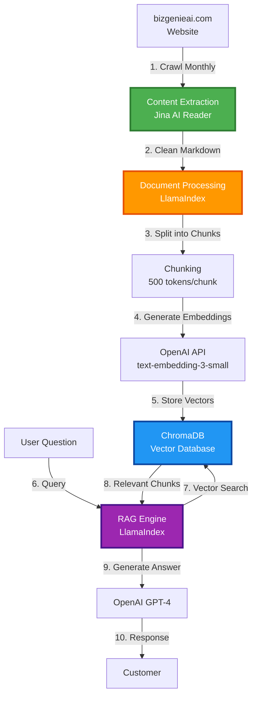
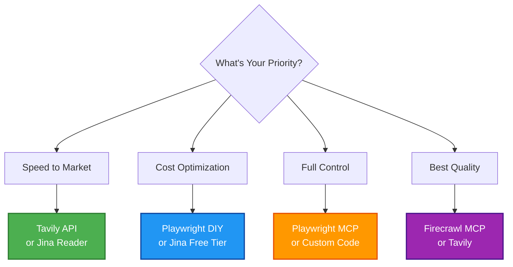
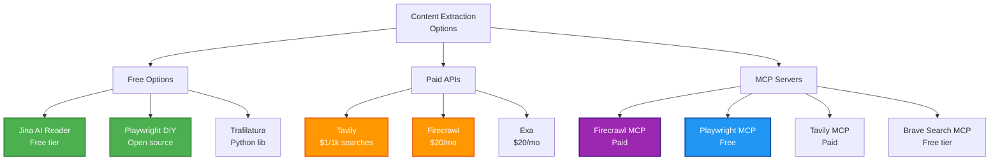

# Website RAG System - Architecture Plan

## Project Overview

**Goal**: Build a RAG system for https://bizgenieai.com to power a customer support chatbot

**Context**:
- Target website: Third-party site (no backend access)
- Use case: Customer support Q&A
- Update frequency: Monthly (rare updates)
- Website type: JavaScript-rendered (likely SPA)

---

## System Architecture



---

## Component Breakdown & Deep Options Exploration

### 1. Content Extraction (The Critical Component)

**Challenge**: Extract clean content from JavaScript-rendered website

Let's explore ALL available options, including modern AI-powered tools and MCP servers:

---

### A. AI-Powered Search & Extraction APIs

#### Tavily Search API ⭐ (Highly Recommended to Explore)

**What**: AI-powered search API specifically designed for RAG and AI agents

**How it works**:
```python
from tavily import TavilyClient

client = TavilyClient(api_key="your-key")
response = client.search(
    query="bizgenie ai services",
    search_depth="advanced",  # or "basic"
    include_raw_content=True   # Get full page content
)
# Returns clean, relevant content optimized for LLMs
```

**Pros**:
- Designed specifically for RAG/LLM use cases
- Returns clean, deduplicated content
- Smart ranking and filtering
- Handles crawling internally
- Extracts relevant snippets automatically
- Good for answering questions about website content

**Cons**:
- Paid API ($1 per 1000 searches on basic plan)
- Search-focused (not direct URL scraping)
- May not get ALL pages, just relevant ones

**Best for**: When you need intelligent content discovery, not full site indexing

**MCP Integration**: Has Tavily MCP server available!

---

#### Exa (formerly Metaphor)

**What**: Neural search engine API for web content

**How it works**:
```python
from exa_py import Exa

exa = Exa(api_key="your-key")
results = exa.search_and_contents(
    "bizgenie ai automation tools",
    num_results=10,
    text=True  # Get full text content
)
```

**Pros**:
- AI-powered semantic search
- Returns clean, structured content
- Good for finding relevant pages
- Has MCP server

**Cons**:
- Paid ($20/month for starter)
- Search-focused, not direct URL extraction

**Best for**: Content discovery across the web

---

#### Jina AI (Multiple Options)

Jina offers TWO ways to access their services:

**Option 1: Jina Reader API (Simple)**
```python
import requests
response = requests.get(f"https://r.jina.ai/{url}")
markdown = response.text
```

**Option 2: Jina MCP Server (Full Featured)** ⭐ NEW!

The Jina MCP server provides 15+ tools including:

**Content Tools**:
- `read_url` - Convert URL to markdown
- `parallel_read_url` - Batch process multiple URLs
- `capture_screenshot_url` - Generate screenshots
- `guess_datetime_url` - Detect publication dates

**Search Tools**:
- `search_web` - Real-time web search
- `search_arxiv` - Academic paper search
- `search_images` - Image search
- `expand_query` - Query optimization
- Parallel versions of all search tools

**Processing Tools**:
- `sort_by_relevance` - Rerank results
- `deduplicate_strings` - Semantic deduplication
- `deduplicate_images` - Image deduplication
- `primer` - Contextual information (no API key needed!)

**Setup (Claude Code)**:
```bash
claude mcp add --transport sse jina https://mcp.jina.ai/sse \
  --header "Authorization: Bearer ${JINA_API_KEY}"
```

**Or in config**:
```json
{
  "mcpServers": {
    "jina-mcp-server": {
      "url": "https://mcp.jina.ai/sse",
      "headers": {
        "Authorization": "Bearer ${JINA_API_KEY}"
      }
    }
  }
}
```

**Pros**:
- 15+ tools in one MCP server
- Some tools work WITHOUT API key (read_url, screenshots, primer)
- Parallel processing capabilities
- Integrated search + extraction
- Free API key available at https://jina.ai
- Remote MCP (no local installation needed)

**Cons**:
- Rate limits on free tier
- Some advanced tools require API key
- Requires MCP-compatible client

**Best for**: Comprehensive web content pipeline with MCP integration

---

### B. MCP Servers for Web Content

Model Context Protocol (MCP) servers can integrate directly with Claude Code!

#### 1. Firecrawl MCP Server 🔥

**What**: Professional web scraping via MCP

**Setup**:
```json
// claude_desktop_config.json
{
  "mcpServers": {
    "firecrawl": {
      "command": "npx",
      "args": ["-y", "@firecrawl/mcp-server"],
      "env": {
        "FIRECRAWL_API_KEY": "your-key"
      }
    }
  }
}
```

**Capabilities**:
- Scrape single URLs
- Crawl entire websites
- Map site structure
- Return clean markdown
- Handle JavaScript

**Pros**:
- Integrated with Claude Code
- Professional-grade scraping
- Handles complex sites
- Auto-detects content types

**Cons**:
- Paid service
- Requires MCP setup

**Pricing**: Pay-as-you-go or subscription

---

#### 2. Brave Search MCP Server

**What**: Web search via MCP

**Setup**:
```json
{
  "mcpServers": {
    "brave-search": {
      "command": "npx",
      "args": ["-y", "@modelcontextprotocol/server-brave-search"],
      "env": {
        "BRAVE_API_KEY": "your-key"
      }
    }
  }
}
```

**Capabilities**:
- Web search
- Local search
- Returns snippets and URLs

**Best for**: Finding relevant pages, not full content extraction

---

#### 3. Playwright MCP Server

**What**: Browser automation via MCP

**Setup**:
```json
{
  "mcpServers": {
    "playwright": {
      "command": "npx",
      "args": ["-y", "@executeautomation/playwright-mcp-server"]
    }
  }
}
```

**Capabilities**:
- Navigate pages
- Click elements
- Extract content
- Handle JavaScript

**Best for**: Complex interactions, SPAs

---

#### 4. Puppeteer MCP Server

**What**: Another browser automation option

Similar to Playwright but using Puppeteer

---

#### 5. Fetch MCP Server

**What**: Simple HTTP fetching via MCP

**Setup**:
```json
{
  "mcpServers": {
    "fetch": {
      "command": "npx",
      "args": ["-y", "@modelcontextprotocol/server-fetch"]
    }
  }
}
```

**Best for**: Basic URL fetching without browser overhead

---

#### 6. Tavily MCP Server

**What**: Tavily search integrated via MCP

**Setup**:
```json
{
  "mcpServers": {
    "tavily": {
      "command": "npx",
      "args": ["-y", "@tavily/mcp-server"],
      "env": {
        "TAVILY_API_KEY": "your-key"
      }
    }
  }
}
```

**Best for**: AI-powered search within Claude Code

---

### F. Jina MCP Server (Comprehensive Option) 🌟

**What**: Complete web content processing suite via MCP

**GitHub**: https://github.com/jina-ai/MCP

**15+ Tools Available**:

1. **Content Extraction**:
   - `read_url` - URL to markdown (works without API key!)
   - `parallel_read_url` - Batch process URLs
   - `capture_screenshot_url` - Screenshots
   - `guess_datetime_url` - Publication date detection

2. **Search**:
   - `search_web` - Web search
   - `search_arxiv` - Academic papers
   - `search_images` - Image search
   - `expand_query` - Query rewriting
   - Parallel versions of all

3. **Processing**:
   - `sort_by_relevance` - Reranking
   - `deduplicate_strings` - Semantic dedup
   - `deduplicate_images` - Visual dedup
   - `primer` - Context extraction (no API key!)

**Setup**:
```json
{
  "mcpServers": {
    "jina": {
      "url": "https://mcp.jina.ai/sse",
      "headers": {
        "Authorization": "Bearer YOUR_JINA_API_KEY"
      }
    }
  }
}
```

**Pricing**:
- Free API key at https://jina.ai
- Some tools work without API key
- Rate limits apply (check dashboard)

**Why This is GREAT for Your Use Case**:
- **Single MCP** covers extraction + search + processing
- **Works without API key** for basic reading
- **Parallel processing** for batch URL extraction
- **Search capability** for content discovery
- **Deduplication** built-in

---

### G. More MCP Servers Worth Exploring

| MCP Server | Purpose | When to Use |
|------------|---------|-------------|
| **Jina MCP** ⭐ | All-in-one: read, search, process | Website RAG projects |
| **@anthropic/mcp-server-exa** | Exa search | Neural web search |
| **@executeautomation/scraper-mcp** | Web scraping | General scraping needs |
| **@modelcontextprotocol/server-everything** | Multi-tool | Multiple capabilities |
| **@cloudflare/mcp-server-r2** | R2 storage | Store scraped content |

---

### C. Traditional Scraping Libraries

#### Jina AI Reader (revisited)
Already covered above

#### Firecrawl API (without MCP)

**Direct API usage**:
```python
from firecrawl import FirecrawlApp

app = FirecrawlApp(api_key="your-key")

# Scrape single page
result = app.scrape_url("https://bizgenieai.com")

# Crawl entire site
crawl_result = app.crawl_url(
    "https://bizgenieai.com",
    params={"maxDepth": 3}
)
```

**Pros**:
- Professional service
- Handles everything
- Great for production

**Cons**:
- Paid ($20/month starter)

---

#### Alternative Traditional Options:

| Tool | Type | Cost | JS Support | Tools Count | Best For |
|------|------|------|------------|-------------|----------|
| **Jina MCP** ⭐ | MCP Server | Free API key | ✅ | 15+ tools | All-in-one RAG |
| **Tavily** | AI Search API | $1/1k searches | ✅ | Search only | Content discovery |
| **Exa** | Neural Search | $20/mo | ✅ | Search only | Semantic search |
| **Firecrawl MCP** | MCP Server | Paid | ✅ | Crawl tools | Production crawling |
| **Jina Reader API** | Simple API | Free tier | ✅ | 1 tool | Quick testing |
| **Firecrawl API** | Direct API | $20/mo | ✅ | API calls | Production scraping |
| **Playwright** | DIY Library | Free | ✅ | Custom | Full control |
| **Trafilatura** | DIY Library | Free | ❌ | Custom | Static HTML |

---

### D. Comparison: Which to Choose?



---

### G. Complete Options Overview



---

### H. Recommended Testing Strategy

Let's test multiple approaches to find what works best for bizgenieai.com:

#### Phase 1: Free Quick Tests (1 hour)

**Test 1: Jina AI Reader**
```bash
# No setup needed!
curl "https://r.jina.ai/https://bizgenieai.com" > tests/jina_output.md
```

**Test 2: Playwright (if you want full control)**
```python
# Quick test script
from playwright.sync_api import sync_playwright

with sync_playwright() as p:
    browser = p.chromium.launch()
    page = browser.new_page()
    page.goto("https://bizgenieai.com")
    content = page.content()

    with open("tests/playwright_output.html", "w") as f:
        f.write(content)

    browser.close()
```

**Compare**:
- Content completeness
- JavaScript handling
- Cleanliness of output

---

#### Phase 2: Paid API Trials (if free options don't work well)

**Option A: Tavily (Best for Q&A-style RAG)**
```python
from tavily import TavilyClient

# Sign up for free trial at https://tavily.com
client = TavilyClient(api_key="tvly-xxx")

# Search for content about the site
response = client.search(
    query="bizgenie ai automation services features",
    search_depth="advanced",
    include_raw_content=True,
    max_results=5
)

print(response)
```

**Option B: Firecrawl**
```python
from firecrawl import FirecrawlApp

# Sign up at https://firecrawl.dev
app = FirecrawlApp(api_key="fc-xxx")

# Scrape single page
result = app.scrape_url(
    "https://bizgenieai.com",
    params={'formats': ['markdown']}
)

print(result['markdown'])
```

---

#### Phase 3: MCP Integration (if you want Claude Code integration)

**Setup Firecrawl MCP** (recommended if going MCP route):

1. Get Firecrawl API key
2. Edit `~/.config/claude/claude_desktop_config.json`:
```json
{
  "mcpServers": {
    "firecrawl": {
      "command": "npx",
      "args": ["-y", "@firecrawl/mcp-server"],
      "env": {
        "FIRECRAWL_API_KEY": "your-key-here"
      }
    }
  }
}
```

3. Restart Claude Code
4. Use Firecrawl tools directly in your workflow!

---

### I. Decision Matrix

| Your Situation | Recommended Approach | Backup Option |
|----------------|---------------------|---------------|
| **Zero budget** | Jina AI Reader | Playwright DIY |
| **Want best quality** | Tavily or Firecrawl | Firecrawl MCP |
| **Need full control** | Playwright + BS4 | Playwright MCP |
| **Want Claude integration** | Firecrawl MCP | Tavily MCP |
| **Quick MVP test** | Jina AI Reader | Tavily search |
| **Production chatbot** | Firecrawl API | Tavily API |
| **Complex JavaScript site** | Playwright or Firecrawl | Puppeteer |
| **Static HTML site** | Trafilatura | Jina AI |

---

### J. My Specific Recommendation for You (UPDATED)

Based on Jina MCP discovery, here are the best paths:

**🌟 Option 1: Jina MCP Server (NEW RECOMMENDATION)**

**Why**: Best all-in-one solution for your needs!

**Setup** (5 minutes):
1. Get free API key at https://jina.ai
2. Add to Claude Code:
```bash
claude mcp add --transport sse jina https://mcp.jina.ai/sse \
  --header "Authorization: Bearer YOUR_JINA_API_KEY"
```

**What you get**:
- ✅ `read_url` for content extraction
- ✅ `parallel_read_url` for batch processing
- ✅ `search_web` for discovering content
- ✅ `sort_by_relevance` for reranking results
- ✅ `deduplicate_strings` to avoid duplicate content
- ✅ All integrated in Claude Code!

**Workflow**:
```python
# 1. Use Jina MCP to read website
# Via Claude Code MCP tools
read_url("https://bizgenieai.com")

# 2. Process with LlamaIndex
# 3. Store in ChromaDB
# 4. Query and answer questions
```

**Cost**: FREE (with API key rate limits)

---

**Option 2: Quick Test First (No Setup)**
1. Test with simple API: `curl https://r.jina.ai/https://bizgenieai.com`
2. If good → Setup Jina MCP for production
3. If not → Try Tavily or Firecrawl

---

**Option 3: Tavily for Smart Discovery**
1. Sign up for Tavily free trial
2. Use for intelligent content discovery
3. Better for Q&A, Jina better for full site indexing

---

**Option 4: Full Control**
1. Playwright for JavaScript rendering
2. More work but totally free
3. Choose if you need custom extraction logic

---

### K. Updated Decision: Why Jina MCP is Now Top Choice

**Jina MCP Advantages**:
- 🎯 All-in-one: extraction + search + processing
- 💰 Free tier with API key
- 🚀 MCP integration (use directly in Claude Code)
- ⚡ Parallel processing for batch operations
- 🔧 15+ tools vs single API call
- 🆓 Some tools work WITHOUT API key

**When NOT to use Jina MCP**:
- Need guaranteed uptime (paid service better)
- Want full control (Playwright better)
- Need specialized crawling (Firecrawl better)

---


### Updated Decision Framework

Consider these factors:

| Factor | If True, Choose |
|--------|----------------|
| **Budget = $0** | Jina AI (free) or Playwright DIY |
| **Need full site crawl** | Firecrawl or Playwright with sitemap |
| **Want MCP integration** | Firecrawl MCP or Playwright MCP |
| **Need intelligent discovery** | Tavily or Exa |
| **Production-ready needed** | Firecrawl API |
| **Custom requirements** | Playwright + BeautifulSoup |
| **Quick MVP test** | Jina AI Reader |

---

### 2. RAG Framework

#### ✅ RECOMMENDED: LlamaIndex

**Why**:
- Built specifically for RAG/document Q&A
- Handles indexing, retrieval, and querying
- Simple API - fastest to prototype
- Great documentation

**Setup**:
```python
from llama_index import VectorStoreIndex, SimpleWebPageReader

# Load documents
documents = SimpleWebPageReader(html_to_text=True).load_data([urls])

# Create index
index = VectorStoreIndex.from_documents(documents)

# Query
response = index.as_query_engine().query("What services does BizGenie offer?")
```

**Alternatives**:

| Framework | Pros | Cons | Choose If |
|-----------|------|------|-----------|
| **LangChain** | Flexible, many integrations | Complex, abstraction overhead | Need custom chains |
| **Haystack** | Production-ready, modular | Steeper learning curve | Enterprise use |
| **Custom** | Full control | Most work | Specific requirements |

**Decision**: LlamaIndex for simplicity and RAG focus

---

### 3. Vector Database

#### ✅ RECOMMENDED: ChromaDB

**Why**:
- Free and open source
- Runs locally (no external dependency)
- Persistent storage
- Perfect for <1000 pages
- Simple API

**Setup**:
```python
import chromadb

# Create client
client = chromadb.PersistentClient(path="./data/chromadb")

# Create collection
collection = client.create_collection("bizgenie_docs")
```

**Alternatives**:

| Database | Pros | Cons | Choose If |
|----------|------|------|-----------|
| **Pinecone** | Fully managed, scalable | Paid service | Production, scale |
| **Qdrant** | Fast, hybrid search | More setup | Need advanced features |
| **FAISS** | Very fast | No persistence by default | Research/experimentation |
| **Weaviate** | Hybrid search built-in | Complex setup | Need keyword + vector |

**Decision**: ChromaDB - perfect balance of simplicity and features

---

### 4. Embeddings

#### ✅ RECOMMENDED: OpenAI text-embedding-3-small

**Why**:
- High quality embeddings
- Simple API
- Cheap: ~$0.02 per 1M tokens
- For your site (~100 pages): ~$0.50 total for initial indexing

**Setup**:
```python
from openai import OpenAI

client = OpenAI(api_key="your-key")
embedding = client.embeddings.create(
    model="text-embedding-3-small",
    input="Your text here"
)
```

**Alternatives**:

| Option | Pros | Cons | Choose If |
|--------|------|------|-----------|
| **text-embedding-3-large** | Better quality | 5x cost | Quality critical |
| **Sentence Transformers** | Free, local | Lower quality, need GPU | Cost-sensitive |
| **Cohere Embeddings** | Good quality | Paid | Alternative to OpenAI |

**Decision**: OpenAI small model - great quality/cost ratio

---

### 5. Chunking Strategy

#### ✅ RECOMMENDED: Markdown-based chunking

**Why**:
- Preserves document structure (headings, sections)
- Jina returns markdown, so perfect match
- Better context than fixed-size

**Configuration**:
```python
from llama_index.node_parser import MarkdownNodeParser

parser = MarkdownNodeParser()
# Respects markdown headings as boundaries
```

**Alternatives**:
- **Fixed-size**: Simple but breaks semantic units
- **Semantic**: Better quality but slower (requires embeddings)
- **Custom**: Most control but most work

**Decision**: Markdown chunking - leverages Jina's output format

---

## Recommended Tech Stack Summary

```
┌─────────────────────────────────────────────┐
│ INDEXING PIPELINE (Run Monthly)            │
├─────────────────────────────────────────────┤
│ 1. Jina AI Reader → Markdown                │
│ 2. LlamaIndex → Process & Chunk             │
│ 3. OpenAI Embeddings → Vectors              │
│ 4. ChromaDB → Store                         │
└─────────────────────────────────────────────┘

┌─────────────────────────────────────────────┐
│ QUERY PIPELINE (Real-time)                 │
├─────────────────────────────────────────────┤
│ 1. User Question → LlamaIndex               │
│ 2. ChromaDB → Retrieve Relevant Chunks      │
│ 3. OpenAI GPT-4 → Generate Answer           │
└─────────────────────────────────────────────┘
```

**Total Dependencies**:
```
llama-index
chromadb
openai
requests
```

**Estimated Costs** (monthly):
- Initial indexing: ~$0.50 (one-time per re-index)
- Per query: ~$0.01-0.02 (depends on GPT-4 usage)
- Storage: FREE (local ChromaDB)

---

## Next Steps

### Phase 1: Test Content Extraction (15 minutes)

**Test if Jina AI works well for bizgenieai.com**:

```python
import requests

# Test extraction
response = requests.get("https://r.jina.ai/https://bizgenieai.com")
print(response.text[:2000])  # Preview content

# Save to file for inspection
with open("test_extraction.md", "w") as f:
    f.write(response.text)
```

**What to check**:
- Is main content captured?
- Is markdown clean and readable?
- Are navigation/footer removed?

### Phase 2: Build MVP (1-2 hours)

If extraction looks good:

1. **Install dependencies**:
```bash
pip install llama-index chromadb openai requests
```

2. **Create indexing script**:
```python
# scripts/index_website.py
from llama_index import VectorStoreIndex, Document
import requests

# 1. Extract content
urls = [
    "https://bizgenieai.com",
    # Add more pages...
]

documents = []
for url in urls:
    response = requests.get(f"https://r.jina.ai/{url}")
    doc = Document(text=response.text, metadata={"url": url})
    documents.append(doc)

# 2. Create index
index = VectorStoreIndex.from_documents(documents)

# 3. Persist
index.storage_context.persist("./data/index")
```

3. **Create query script**:
```python
# scripts/query.py
from llama_index import load_index_from_storage, StorageContext

# Load index
storage_context = StorageContext.from_defaults(persist_dir="./data/index")
index = load_index_from_storage(storage_context)

# Query
query_engine = index.as_query_engine()
response = query_engine.query("What services does BizGenie offer?")
print(response)
```

### Phase 3: Iterate & Improve

Based on results:
- Adjust chunk size if needed
- Add more pages
- Tune retrieval parameters
- Build chatbot interface (Gradio, Streamlit, etc.)

---

## Decision Log

| Decision | Options Considered | Chosen | Reasoning |
|----------|-------------------|--------|-----------|
| **Content Extraction** | Jina, Firecrawl, Playwright, Trafilatura | Jina AI Reader | Simplest, handles JS, free tier, perfect for monthly updates |
| **Framework** | LlamaIndex, LangChain, Custom | LlamaIndex | Built for RAG, simple API, fastest to prototype |
| **Vector DB** | ChromaDB, Pinecone, Qdrant | ChromaDB | Free, local, persistent, perfect for <1000 pages |
| **Embeddings** | OpenAI (small/large), Sentence Transformers | OpenAI small | Great quality/cost, simple API, ~$0.50 total |
| **Chunking** | Fixed, Semantic, Markdown | Markdown | Leverages Jina output, preserves structure |

---

## Files to Create

```
website-rag/
├── PLAN.md                    # This file
├── .env                       # API keys (git-ignored)
├── requirements.txt           # Dependencies
├── scripts/
│   ├── test_extraction.py    # Test Jina output
│   ├── index_website.py      # Build index
│   └── query.py              # Test queries
├── data/
│   ├── index/                # ChromaDB index
│   └── raw/                  # Raw markdown files
└── app.py                    # Chatbot interface (future)
```

---

## Questions to Validate

Before implementation:
1. Does Jina AI extract good content from bizgenieai.com?
2. How many pages need indexing? (affects cost/time)
3. Do we have OpenAI API access?
4. Any specific content types to prioritize? (services, pricing, FAQ, etc.)

Ready to test extraction and build MVP?
