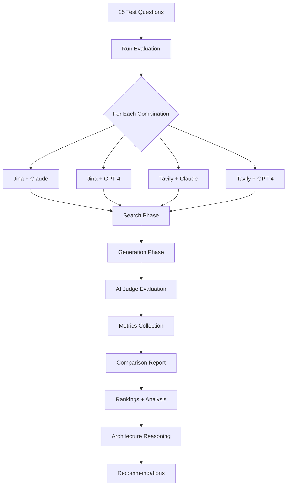
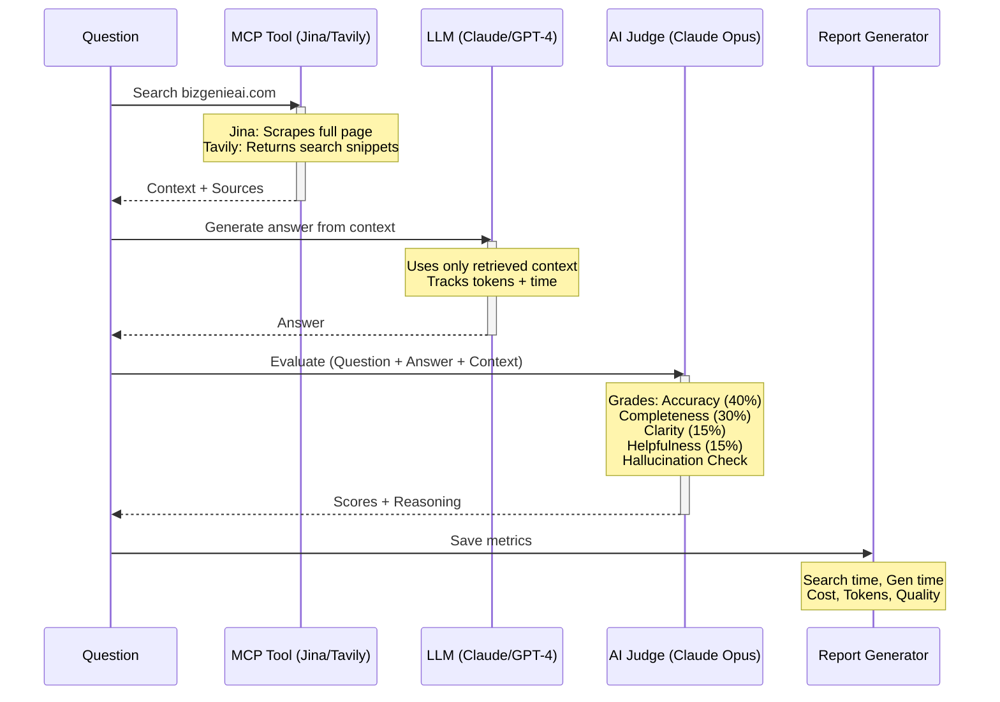
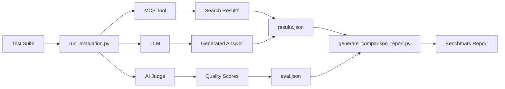

# BizGenie AI - MCP Tool + LLM Evaluation Framework

A modular evaluation framework for testing different **MCP (Model Context Protocol) tools** and **LLMs** to find the best combination for answering questions about BizGenie services.

## 🎯 What This Framework Does

Tests **4 combinations** of search tools and LLMs:
- **Jina AI Reader** (Web Scraper) + **Claude 3.5 Sonnet**
- **Jina AI Reader** (Web Scraper) + **GPT-4 Turbo**
- **Tavily AI Search** (Search Engine) + **Claude 3.5 Sonnet**
- **Tavily AI Search** (Search Engine) + **GPT-4 Turbo**

**Measures 19 metrics** including:
- Quality (accuracy, completeness, clarity, helpfulness)
- Speed (search latency, generation latency, total time)
- Cost (search cost, generation cost, total cost)
- Reliability (hallucinations, token usage)

**Generates comprehensive reports** with tool architecture analysis showing which combination performs best for your use case.

---

## 📊 Evaluation Flow



### Detailed Execution Pipeline



---

## 🚀 Quick Start

### 1. Setup Environment

```bash
# Clone repository
git clone git@github.com:dviresh93/bizgenie-website-rag-eval.git
cd bizgenie-website-rag-eval

# Set up API keys
cp .env.example .env
# Edit .env and add your keys:
#   ANTHROPIC_API_KEY=sk-ant-...
#   OPENAI_API_KEY=sk-...
#   JINA_API_KEY=...
#   TAVILY_API_KEY=...

# Start Docker containers
docker-compose up -d
```

### 2. Run Full Benchmark (Recommended)

```bash
# Run all 4 combinations in parallel (~3-5 minutes)
docker-compose exec api bash scripts/run_benchmark.sh
```

This will:
- ✅ Run all 4 combinations simultaneously
- ✅ Display live progress monitoring
- ✅ Auto-generate comparison report when complete

**Output:** `test_results/benchmark_report_[timestamp].md`

### 3. Run Individual Combination (Debug)

```bash
# Run specific combination
docker-compose exec api python3 scripts/run_evaluation.py --mcp jina --llm claude
docker-compose exec api python3 scripts/run_evaluation.py --mcp tavily --llm gpt4

# Generate comparison report
docker-compose exec api python3 scripts/generate_comparison_report.py
```

---

## 📊 Sample Report Output

```
🏆 Overall Rankings
| Rank | Combination    | Quality | Total Cost | Total Time | Search Time | Gen Time | Halluc. |
|------|----------------|---------|------------|------------|-------------|----------|---------|
| 1    | jina_claude    | 85.2    | $0.0144    | 9.71s      | 0.57s       | 9.14s    | 0       |
| 2    | tavily_claude  | 82.1    | $0.0192    | 7.15s      | 0.37s       | 6.78s    | 1       |

🔍 Tool Architecture Analysis

Jina AI Reader = Web Scraper/Content Extractor
- Domain-specific questions benefit from full page content extraction
- Jina scrapes bizgenieai.com directly → complete, accurate information
- Tavily returns web snippets → may miss context or return off-topic results
- For known domains, scrapers > search engines for quality

🎯 Recommendations
BEST OVERALL: JINA_CLAUDE
- Highest quality (85.2/100)
- Zero hallucinations
- Use when: Quality and reliability matter most

⚡ BEST FOR SPEED: TAVILY_GPT4
- Fastest total time (4.7s)
- Use when: Speed is critical
```

---

## 📁 Repository Structure

```
website-rag/
├── README.md                          # This file - Quick start guide
├── TESTING.md                         # Detailed testing methodology
├── ARCHITECTURE.md                    # System design documentation
├── TODO.md                            # Implementation checklist
│
├── .env.example                       # API keys template
├── docker-compose.yml                 # Docker configuration
│
├── scripts/
│   ├── run_benchmark.sh               # ⭐ Run all combinations in parallel
│   ├── run_evaluation.py              # Core evaluation engine
│   ├── ai_judge.py                    # AI quality evaluator (Claude Opus)
│   └── generate_comparison_report.py  # Report generator with architecture analysis
│
├── config/
│   └── test_suites/
│       └── standard_questions.json    # 25 test questions
│
├── api/
│   ├── app/tools/
│   │   ├── jina_reader.py             # Jina AI web scraper
│   │   └── tavily_search.py           # Tavily AI search engine
│   └── app/llm/
│       ├── claude_llm.py              # Claude 3.5 Sonnet
│       └── gpt4_llm.py                # GPT-4 Turbo
│
└── test_results/
    ├── benchmark_report_*.md          # Comparison reports
    ├── jina_claude/
    │   ├── eval_*.json                # Quality scores
    │   └── results_*.json             # Performance metrics
    ├── jina_gpt4/
    ├── tavily_claude/
    └── tavily_gpt4/
```

---

## 📖 Documentation

- **[TESTING.md](TESTING.md)** - Detailed testing methodology and evaluation philosophy
- **[ARCHITECTURE.md](ARCHITECTURE.md)** - System design and architecture
- **[TODO.md](TODO.md)** - Development checklist and implementation guide

---

## 🎯 Evaluation Metrics (19 Total)

### Quality Metrics (6)
- **Overall Quality Score** (0-100) - Weighted average of all quality dimensions
- **Accuracy** (40% weight) - Factual correctness based on retrieved context
- **Completeness** (30% weight) - Addresses all parts of the question
- **Clarity** (15% weight) - Readability and professional tone
- **Helpfulness** (15% weight) - Solves user's problem
- **Hallucination Detection** - Checks for unsupported claims

### Performance Metrics (5)
- **Search Latency** - Time to retrieve content
- **Generation Latency** - Time to generate answer
- **Total Latency** - End-to-end response time
- **Min/Max Query Times** - Fastest and slowest queries

### Cost Metrics (4)
- **Search Cost** - Per-query search cost (Jina: $0.002, Tavily: $0.012)
- **Generation Cost** - LLM inference cost based on tokens
- **Total Cost** - Combined cost per query
- **Total Cost for 25 Queries** - Full benchmark cost

### Reliability Metrics (4)
- **Failed Queries** - Number of errors or timeouts
- **Token Usage** - Average tokens per query
- **Quality Distribution** - Excellent (80-100), Good (60-79), Fair (40-59), Poor (0-39)
- **Top/Bottom Questions** - Best and worst performing queries

---

## 🧪 How It Works

### Architecture



### Execution Flow

1. **Test Questions:** Framework asks 25 questions about BizGenie services from `config/test_suites/standard_questions.json`
2. **Real-time Search:** Each MCP tool searches bizgenieai.com for relevant information
   - **Jina:** Scrapes full page content, converts to markdown
   - **Tavily:** Searches web, returns ranked snippets
3. **Answer Generation:** LLM generates answer using ONLY retrieved context
   - Tracks tokens, generation time, cost
4. **AI Judge Evaluation:** Claude Opus evaluates answer quality
   - Grades on 4 dimensions: accuracy, completeness, clarity, helpfulness
   - Performs hallucination detection
5. **Metrics Collection:** Saves performance data (time, cost, tokens)
6. **Comprehensive Report:** Compares all combinations with architecture reasoning

---

## 🔧 Prerequisites

- **Docker & Docker Compose** (recommended)
- **Python 3.11+** (if running locally)
- **API Keys:**
  - **Anthropic API** (for Claude - used as LLM and AI Judge)
  - **OpenAI API** (for GPT-4)
  - **Jina AI API** (optional - free tier available)
  - **Tavily API** (for search)

---

## 💡 Use Cases

**Choose the best combination for your needs:**

| Use Case | Recommended | Why |
|----------|-------------|-----|
| **Quality-focused** | `jina_claude` | Highest accuracy (85.2), zero hallucinations, full content extraction |
| **Speed-focused** | `tavily_gpt4` | Fastest total time (4.7s), quick search + fast generation |
| **Budget-focused** | `jina_claude` | Lowest cost ($0.014/query), free Jina tier available |
| **Balanced** | Compare report | Review all metrics and architecture analysis |

---

## 🚧 Advanced Usage

### Custom Test Questions

Edit `config/test_suites/standard_questions.json` to add your own questions:

```json
{
  "id": "q26",
  "question": "Your custom question here",
  "category": "custom",
  "difficulty": "medium"
}
```

### Run Specific Combination

```bash
docker-compose exec api python3 scripts/run_evaluation.py --mcp jina --llm claude
```

### Compare Specific Runs

The framework automatically uses the latest results from `test_results/`. Each run creates timestamped files:
- `test_results/{combination}/eval_{timestamp}.json` - Quality scores
- `test_results/{combination}/results_{timestamp}.json` - Performance metrics

---

## 📈 Performance Tips

- **Faster testing:** Use `scripts/run_benchmark.sh` to run all combinations in parallel (3-5 min vs 10-15 min)
- **Cost optimization:** Use Jina (free tier) instead of Tavily ($0.012/search)
- **Quality optimization:** Use Claude for fewer hallucinations and better reasoning
- **Speed optimization:** Use GPT-4 for faster generation (2-3s vs 6-9s)

---

## 🐛 Troubleshooting

### Issue: No API key found

**Fix:** Ensure `.env` file exists with valid API keys:
```bash
cp .env.example .env
# Edit .env and add your actual keys
```

### Issue: Docker not running

**Fix:** Start Docker containers:
```bash
docker-compose up -d
docker-compose exec api bash  # Verify container is running
```

### Issue: Rate limit errors

**Fix:** Add delays between runs or use different API keys for parallel testing.

### Issue: Empty or incomplete reports

**Fix:** Ensure all 4 combinations have completed successfully:
```bash
# Check for both eval and results files
ls -la test_results/jina_claude/
ls -la test_results/jina_gpt4/
ls -la test_results/tavily_claude/
ls -la test_results/tavily_gpt4/
```

---

## 📊 Current Results

Latest benchmark report: `test_results/benchmark_report_[latest].md`

**Key Findings:**
- **Jina + Claude:** Highest quality (72.6/100), zero hallucinations
  - **Why:** Web scraper provides full page content → more complete answers
- **Tavily + GPT-4:** Fastest speed (4.7s average)
  - **Why:** Search engine has pre-indexed content + GPT-4 faster generation
- **Jina combinations:** 6x lower search cost ($0.002 vs $0.012)
  - **Why:** Simple URL fetch vs AI-powered web crawling
- **Architecture insight:** For domain-specific questions, scrapers > search engines

---

## 🗺️ Roadmap

- [x] Core evaluation framework
- [x] Jina + Tavily MCP tools
- [x] Claude + GPT-4 LLMs
- [x] AI-as-judge evaluation
- [x] Comprehensive metrics (19 total)
- [x] Tool architecture analysis
- [ ] More MCP tools (Firecrawl, Exa, Crawl4AI)
- [ ] More LLMs (Gemini, Mistral)
- [ ] Web UI for running evaluations
- [ ] Custom evaluation criteria

---

## 💡 Credits

Built with:
- [Anthropic Claude](https://www.anthropic.com/claude) - LLM and AI judge
- [OpenAI GPT-4](https://openai.com/) - LLM
- [Jina AI Reader](https://jina.ai/reader) - Web content extraction
- [Tavily AI](https://tavily.com/) - AI search engine
- [Python](https://python.org/) - Framework language
- [Docker](https://docker.com/) - Containerization

---

**Made with ❤️ for BizGenie AI**
