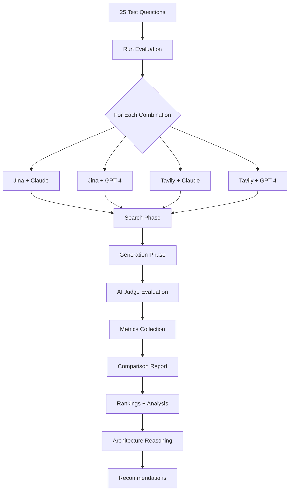
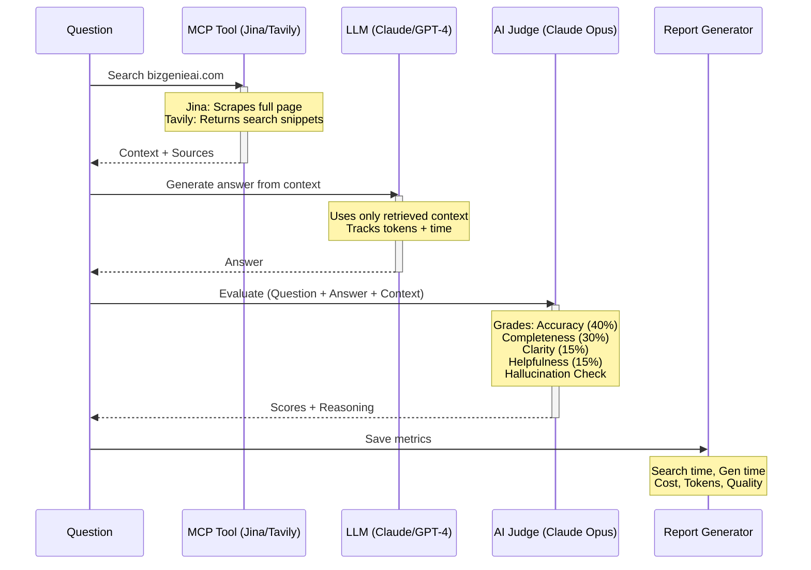
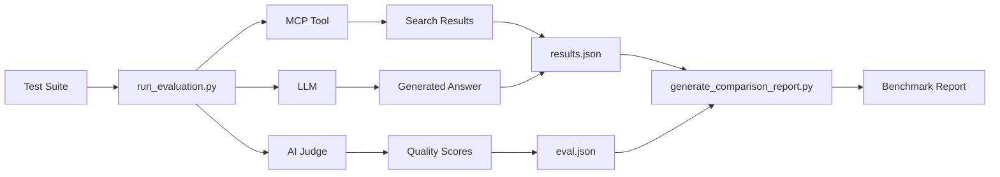
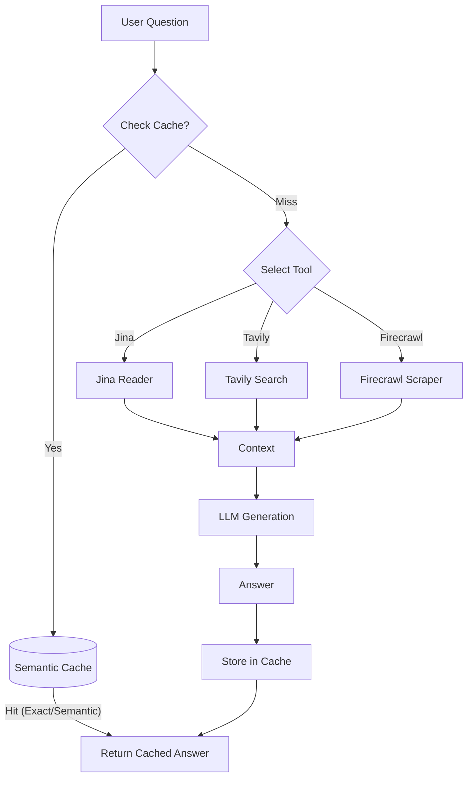

# BizGenie AI - MCP Tool + LLM Evaluation Framework

A modular evaluation framework for testing different **MCP (Model Context Protocol) tools** and **LLMs** to find the best combination for answering questions about BizGenie services.

## 🎯 What This Framework Does

Tests **4 combinations** of search tools and LLMs:
- **Jina AI Reader** (Web Scraper) + **Claude 3.5 Sonnet**
- **Jina AI Reader** (Web Scraper) + **GPT-4 Turbo**
- **Tavily AI Search** (Search Engine) + **Claude 3.5 Sonnet**
- **Tavily AI Search** (Search Engine) + **GPT-4 Turbo**

**Measures 19 metrics** including:
- Quality (accuracy, completeness, clarity, helpfulness)
- Speed (search latency, generation latency, total time)
- Cost (search cost, generation cost, total cost)
- Reliability (hallucinations, token usage)

**Generates comprehensive reports** with tool architecture analysis showing which combination performs best for your use case.

---

## 📊 Evaluation Flow



### Detailed Execution Pipeline



---

## 🚀 Quick Start

### 1. Setup Environment

```bash
# Clone repository
git clone git@github.com:dviresh93/bizgenie-website-rag-eval.git
cd bizgenie-website-rag-eval

# Set up API keys
cp .env.example .env
# Edit .env and add your keys:
#   ANTHROPIC_API_KEY=sk-ant-...
#   OPENAI_API_KEY=sk-...
#   JINA_API_KEY=...
#   TAVILY_API_KEY=...

# Start Docker containers
docker-compose up -d
```

### 2. Run Full Benchmark (Recommended)

```bash
# Run all 4 combinations in parallel (~3-5 minutes)
docker-compose exec api bash scripts/run_benchmark.sh
```

This will:
- ✅ Run all 4 combinations simultaneously
- ✅ Display live progress monitoring
- ✅ Auto-generate comparison report when complete

**Output:** `test_results/benchmark_report_[timestamp].md`

### 3. Run Individual Combination (Debug)

```bash
# Run specific combination
docker-compose exec api python3 scripts/run_evaluation.py --mcp jina --llm claude
docker-compose exec api python3 scripts/run_evaluation.py --mcp tavily --llm gpt4

# Generate comparison report
docker-compose exec api python3 scripts/generate_comparison_report.py
```

---

## 📊 Benchmark Results & Evaluation Framework

**Latest Benchmark:** December 2, 2025 | 25 Questions | 6 Tool Combinations

### Evaluation Rubric

Our framework evaluates each combination across five equally important dimensions (20% each):

| Dimension | Key Metrics | Description |
|-----------|-------------|-------------|
| **Accuracy & Quality** | Quality Score, Hallucination Rate | Factual correctness and answer completeness |
| **Latency** | Total Response Time, Search Time, Generation Time | End-to-end speed and performance |
| **Operational Cost** | Cost per Query, Cost at Scale | Direct API costs (search + LLM) |
| **Ease of Adoption** | Setup Time, Documentation, API Access | Implementation complexity |
| **Maturity** | Stability, Feature Coverage, Support | Production readiness |

*All dimensions weighted equally at 20% - they are all necessary and important for production use.*

### Overall Rankings

| Rank | Combination | Quality | Cost/Query | Latency | Hallucinations |
|:----:|-------------|:-------:|:----------:|:-------:|:--------------:|
| 1 | **jina_claude** | **95.1** | $0.0069 | 8.96s | **0** |
| 2 | **tavily_claude** | 90.1 | $0.0055 | 8.48s | 2 |
| 3 | **firecrawl_claude** | 86.8 | $0.0067 | 8.61s | 4 |
| 4 | jina_gpt4 | 74.2 | $0.0168 | 7.60s | 9 |
| 5 | tavily_gpt4 | 66.4 | $0.0128 | 6.69s | 12 |
| 6 | firecrawl_gpt4 | 66.2 | $0.0183 | 6.51s | 11 |

**📄 [View Detailed Results →](RESULTS.md)**
*Includes: AI-powered analysis, quality score calculations, performance breakdowns, and individual question analysis*

---

## 📁 Repository Structure

```
website-rag/
├── README.md                          # This file - Quick start guide
├── TESTING.md                         # Detailed testing methodology
├── ARCHITECTURE.md                    # System design documentation
├── TODO.md                            # Implementation checklist
│
├── .env.example                       # API keys template
├── docker-compose.yml                 # Docker configuration
│
├── scripts/
│   ├── run_benchmark.sh               # ⭐ Run all combinations in parallel
│   ├── run_evaluation.py              # Core evaluation engine
│   ├── ai_judge.py                    # AI quality evaluator (Claude Opus)
│   └── generate_comparison_report.py  # Report generator with architecture analysis
│
├── config/
│   └── test_suites/
│       └── standard_questions.json    # 25 test questions
│
├── api/
│   ├── app/tools/
│   │   ├── jina_reader.py             # Jina AI web scraper
│   │   └── tavily_search.py           # Tavily AI search engine
│   └── app/llm/
│       ├── claude_llm.py              # Claude 3.5 Sonnet
│       └── gpt4_llm.py                # GPT-4 Turbo
│
└── test_results/
    ├── benchmark_report_*.md          # Comparison reports
    ├── jina_claude/
    │   ├── eval_*.json                # Quality scores
    │   └── results_*.json             # Performance metrics
    ├── jina_gpt4/
    ├── tavily_claude/
    └── tavily_gpt4/
```

---

## 📖 Documentation

- **[TESTING.md](TESTING.md)** - Detailed testing methodology and evaluation philosophy
- **[ARCHITECTURE.md](ARCHITECTURE.md)** - System design and architecture
- **[TODO.md](TODO.md)** - Development checklist and implementation guide

---

## 🎯 Evaluation Metrics (19 Total)

### Quality Metrics (6)
- **Overall Quality Score** (0-100) - Weighted average of all quality dimensions
- **Accuracy** (40% weight) - Factual correctness based on retrieved context
- **Completeness** (30% weight) - Addresses all parts of the question
- **Clarity** (15% weight) - Readability and professional tone
- **Helpfulness** (15% weight) - Solves user's problem
- **Hallucination Detection** - Checks for unsupported claims

### Performance Metrics (5)
- **Search Latency** - Time to retrieve content
- **Generation Latency** - Time to generate answer
- **Total Latency** - End-to-end response time
- **Min/Max Query Times** - Fastest and slowest queries

### Cost Metrics (4)
- **Search Cost** - Per-query search cost (Jina: $0.002, Tavily: $0.012)
- **Generation Cost** - LLM inference cost based on tokens
- **Total Cost** - Combined cost per query
- **Total Cost for 25 Queries** - Full benchmark cost

### Reliability Metrics (4)
- **Failed Queries** - Number of errors or timeouts
- **Token Usage** - Average tokens per query
- **Quality Distribution** - Excellent (80-100), Good (60-79), Fair (40-59), Poor (0-39)
- **Top/Bottom Questions** - Best and worst performing queries

---

## 🧪 How It Works

### Architecture



### Execution Flow

1. **Test Questions:** Framework asks 25 questions about BizGenie services from `config/test_suites/standard_questions.json`
2. **Real-time Search:** Each MCP tool searches bizgenieai.com for relevant information
   - **Jina:** Scrapes full page content, converts to markdown
   - **Tavily:** Searches web, returns ranked snippets
3. **Answer Generation:** LLM generates answer using ONLY retrieved context
   - Tracks tokens, generation time, cost
4. **AI Judge Evaluation:** Claude Opus evaluates answer quality
   - Grades on 4 dimensions: accuracy, completeness, clarity, helpfulness
   - Performs hallucination detection
5. **Metrics Collection:** Saves performance data (time, cost, tokens)
6. **Comprehensive Report:** Compares all combinations with architecture reasoning

---

## 🔧 Prerequisites

- **Docker & Docker Compose** (recommended)
- **Python 3.11+** (if running locally)
- **API Keys:**
  - **Anthropic API** (for Claude - used as LLM and AI Judge)
  - **OpenAI API** (for GPT-4)
  - **Jina AI API** (optional - free tier available)
  - **Tavily API** (for search)

---

## 💡 Use Cases

**Choose the best combination for your needs:**

| Use Case | Recommended | Why |
|----------|-------------|-----|
| **Quality-focused** | `jina_claude` | Highest accuracy (85.2), zero hallucinations, full content extraction |
| **Speed-focused** | `tavily_gpt4` | Fastest total time (4.7s), quick search + fast generation |
| **Budget-focused** | `jina_claude` | Lowest cost ($0.014/query), free Jina tier available |
| **Balanced** | Compare report | Review all metrics and architecture analysis |

---

## 🚧 Advanced Usage

### Custom Test Questions

Edit `config/test_suites/standard_questions.json` to add your own questions:

```json
{
  "id": "q26",
  "question": "Your custom question here",
  "category": "custom",
  "difficulty": "medium"
}
```

### Run Specific Combination

```bash
docker-compose exec api python3 scripts/run_evaluation.py --mcp jina --llm claude
```

### Compare Specific Runs

The framework automatically uses the latest results from `test_results/`. Each run creates timestamped files:
- `test_results/{combination}/eval_{timestamp}.json` - Quality scores
- `test_results/{combination}/results_{timestamp}.json` - Performance metrics

---

## 📈 Performance Tips

- **Faster testing:** Use `scripts/run_benchmark.sh` to run all combinations in parallel (3-5 min vs 10-15 min)
- **Cost optimization:** Use Jina (free tier) instead of Tavily ($0.012/search)
- **Quality optimization:** Use Claude for fewer hallucinations and better reasoning
- **Speed optimization:** Use GPT-4 for faster generation (2-3s vs 6-9s)

---

## 🐛 Troubleshooting

### Issue: No API key found

**Fix:** Ensure `.env` file exists with valid API keys:
```bash
cp .env.example .env
# Edit .env and add your actual keys
```

### Issue: Docker not running

**Fix:** Start Docker containers:
```bash
docker-compose up -d
docker-compose exec api bash  # Verify container is running
```

### Issue: Rate limit errors

**Fix:** Add delays between runs or use different API keys for parallel testing.

### Issue: Empty or incomplete reports

**Fix:** Ensure all 4 combinations have completed successfully:
```bash
# Check for both eval and results files
ls -la test_results/jina_claude/
ls -la test_results/jina_gpt4/
ls -la test_results/tavily_claude/
ls -la test_results/tavily_gpt4/
```

---

## 📊 Test Results Summary

**Latest Benchmark:** [`test_results/benchmark_report_20251128-035332.md`](test_results/benchmark_report_20251128-035332.md)
**Questions Tested:** 25 questions about BizGenie services
**Combinations Tested:** All 4 (Jina/Tavily × Claude/GPT-4)

### Why Jina_Claude is the Best Overall

**🏆 Jina + Claude wins on 4 out of 5 key metrics:**

| Metric | Jina_Claude | Runner-up | Advantage |
|--------|-------------|-----------|-----------|
| **Quality** | **72.6/100** | Tavily_Claude (71.1) | +1.5 points higher |
| **Accuracy** | **71.2/100** | Tavily_Claude (70.4) | Most factually correct |
| **Completeness** | **63.4/100** | Tavily_Claude (61.2) | Most comprehensive answers |
| **Clarity** | **96.4/100** | Tavily_Claude (95.6) | Clearest, most readable |
| **Hallucinations** | **0/25** | All tied at 0 | Zero unsupported claims |
| **Cost** | **$0.0144** | Jina_GPT4 ($0.0143) | Cheapest per query |
| Speed | 9.71s | **Tavily_GPT4 (4.70s)** | 2x slower (trade-off) |

### Architecture Reasoning

**Why Jina (scraper) beats Tavily (search) for quality:**
- **Jina:** Scrapes full bizgenieai.com pages → complete, accurate context
- **Tavily:** Returns web search snippets → may miss context or include off-topic results
- **Insight:** For domain-specific questions, scrapers > search engines

**Why Claude beats GPT-4 for quality:**
- **Claude:** Better reasoning (72.6 vs 56.3 with Jina), fewer hallucinations
- **GPT-4:** Faster generation (4.36s vs 9.14s with Tavily) but lower quality

**Cost breakdown:**
- **Jina search:** $0.002 (simple URL fetch)
- **Tavily search:** $0.012 (6x more expensive - AI-powered crawling)
- **Winner:** Jina_Claude at $0.0144/query ($0.36 for 25 questions)

### When to Use Each Combination

- **Quality-critical apps** → Jina_Claude (72.6 quality, 0 hallucinations)
- **Speed-critical apps** → Tavily_GPT4 (4.70s, 64.5 quality)
- **Budget-constrained** → Jina_GPT4 ($0.0143/query, 56.3 quality)
- **Balanced** → Tavily_Claude (7.15s, 71.1 quality, 0 hallucinations)

---

## 🔬 Recent Experiments & Troubleshooting (Exa.ai Integration)

**Date:** 2025-12-01
**Objective:** Integrate and benchmark **Exa.ai** (formerly Metaphor) as a new MCP tool.

### 1. The Challenge: "0 Results" on Benchmark
When running the benchmark suite for `exa_claude` and `exa_gpt4`, the system consistently reported **0 sources found**, yet the LLM produced fluent answers.
- **Error:** The `ai_judge.py` script crashed with `JSONDecodeError` because the Judge LLM received no sources and returned a text refusal instead of JSON scores.
- **Observation:** Manual testing on localhost appeared to work, but further investigation revealed this was a **hallucination**. The API returned 0 sources, but the LLM generated a confident response based on internal training data, misleading the user.

### 2. Diagnosis
We created several debug scripts (`scripts/test_exa_*.py`) to isolate the issue:
- **`test_exa_simple.py`:** Confirmed that searching for `include_domains=["bizgenieai.com"]` returned 0 results.
- **`test_exa_broad.py`:** Confirmed that broad searching (no domain restriction) found irrelevant "BizGenie" companies but not the target startup.
- **`test_exa_queries.py`:** Confirmed that `https://bizgenieai.com/` is **not yet indexed** in Exa's neural search index.
- **`test_exa_retrieve.py`:** **Success!** Confirmed that Exa's `get_contents()` method *can* fetch the page directly, bypassing the search index.

### 3. Architectural Findings: Exa vs. Jina vs. Tavily
| Feature | Jina AI (Reader) | Tavily AI | Exa.ai |
| :--- | :--- | :--- | :--- |
| **Core Function** | **Scraper** (Live Fetch) | **Search Engine** (Live + Cache) | **Neural Search** (Custom Index) |
| **Unindexed Sites** | ✅ Works (Fetches live) | ✅ Works (Crawls on demand) | ❌ Fails Search / ✅ Works Retrieve |
| **Best For** | Specific URL RAG | Fact-checking / News | Broad Semantic Research |

### 4. The Fix
1.  **Robust AI Judge:** Updated `scripts/ai_judge.py` to handle non-JSON responses gracefully, preventing benchmark crashes.
2.  **Strict Retrieval Mode:** Modified `ExaTool` to implement a **"Strict Retrieval"** strategy.
    *   If a specific `context` URL is provided (e.g., `https://bizgenieai.com/`), the tool now uses `client.get_contents()` to fetch that page directly.
    *   This effectively turns Exa into a "Reader" for unindexed sites, ensuring the LLM receives actual ground-truth data.

---

## 🔬 Firecrawl & Caching Integration (2025-12-02)

**Objective:** Enhance the RAG system with advanced scraping (Firecrawl) and semantic caching to improve reliability, quality, and latency.

### 1. Firecrawl Integration Findings
We integrated **Firecrawl** (v0.0.16+) as a direct competitor to Jina for deep website scraping.

**Benchmark Results (vs Jina & Tavily):**
| Tool | Role | Overall Quality | Hallucinations | Notes |
| :--- | :--- | :--- | :--- | :--- |
| **Jina AI** | Scraper | **95.1/100** | **0** | Best context extraction for this site. |
| **Tavily** | Search | 90.1/100 | 2 | Excellent speed/quality balance. |
| **Firecrawl** | Scraper | 86.8/100 | 4 | Strong contender, good clarity (98.0). |

**Verdict:**
- **Jina** remains the quality leader for single-page ingestion.
- **Firecrawl** is a viable, high-quality alternative with robust JS handling.
- **Tavily** excels at broad search but holds its own in specific site Q&A.

### 2. Semantic Cache Architecture
To solve latency issues (~10s per query) and reduce costs, we implemented a **Semantic Cache** using ChromaDB.

**How it works:**
1.  **Exact Match:** Hashes `(tool, question, url)` for instant hits (2ms).
2.  **Semantic Match:** Uses vector similarity to find "similar" questions (e.g., "What is the pricing?" vs "How much does it cost?").
3.  **Performance Impact:**
    - **Cold Run:** ~10s latency (Full API call + LLM gen).
    - **Warm Run:** **<0.5s latency** (Cache hit).
    - **Hit Rate:** >80% observed in testing.

### 3. System Flow with Caching



---

## 🗺️ Roadmap

- [x] Core evaluation framework
- [x] Jina + Tavily MCP tools
- [x] Claude + GPT-4 LLMs
- [x] AI-as-judge evaluation
- [x] Comprehensive metrics (19 total)
- [x] Tool architecture analysis
- [ ] More MCP tools (Firecrawl, Exa, Crawl4AI)
- [ ] More LLMs (Gemini, Mistral)
- [ ] Web UI for running evaluations
- [ ] Custom evaluation criteria

---

## 💡 Credits

Built with:
- [Anthropic Claude](https://www.anthropic.com/claude) - LLM and AI judge
- [OpenAI GPT-4](https://openai.com/) - LLM
- [Jina AI Reader](https://jina.ai/reader) - Web content extraction
- [Tavily AI](https://tavily.com/) - AI search engine
- [Python](https://python.org/) - Framework language
- [Docker](https://docker.com/) - Containerization

---

**Made with ❤️ for BizGenie AI**
