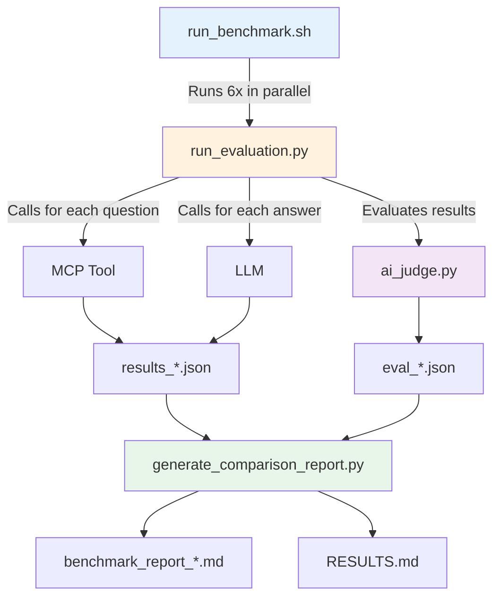
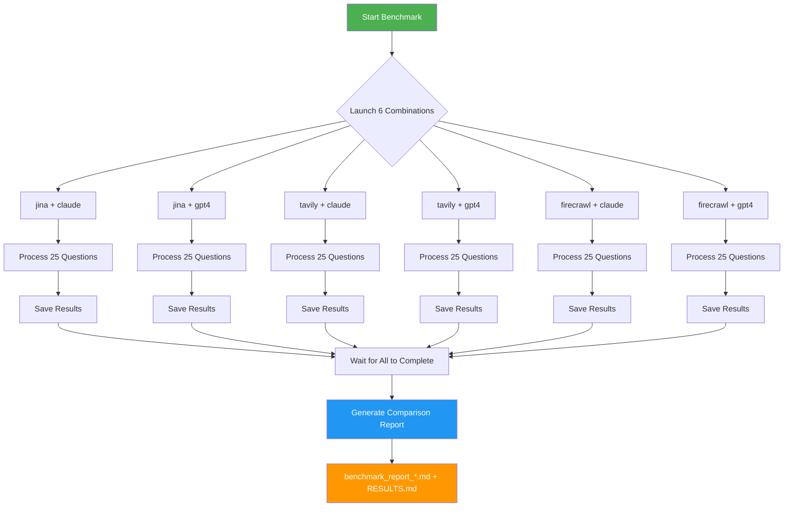
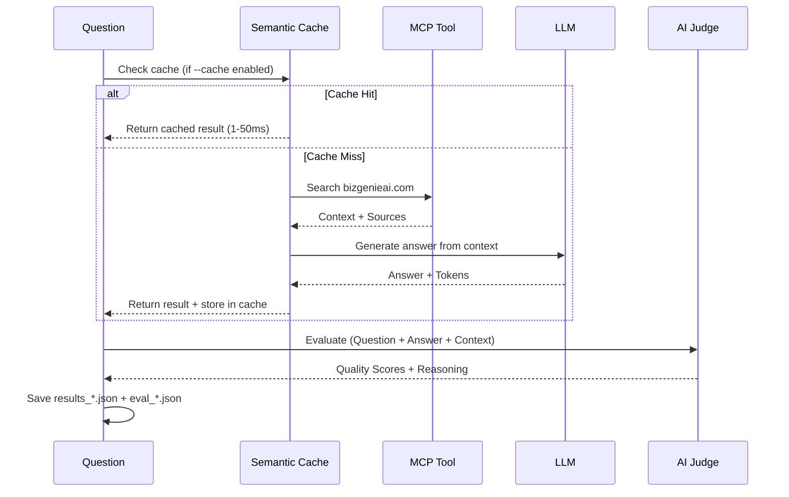
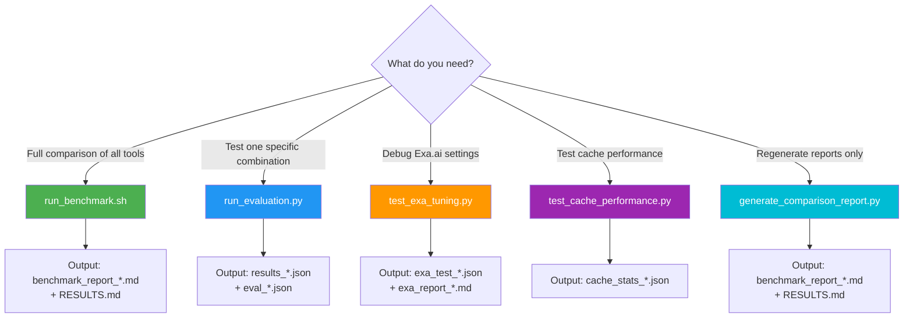
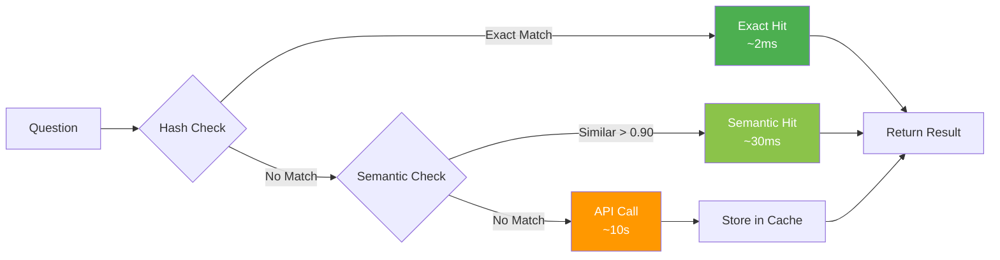

# 🧪 BizGenie RAG Testing Framework

**Complete guide to testing, benchmarking, and analyzing RAG system performance.**

---

## 📑 Table of Contents

- [Quick Start](#-quick-start)
- [Scripts Reference](#-scripts-reference)
- [Testing Workflow](#-testing-workflow)
- [Evaluation Methodology](#-evaluation-methodology)
- [Analyzing Results](#-analyzing-results)
- [Visualizing Results](#-visualizing-results)
- [File Structure](#-file-structure)
- [Troubleshooting](#-troubleshooting)

---

## 🚀 Quick Start

### Run Full Benchmark (Recommended)
```bash
# Run all 6 combinations in parallel (~3-5 minutes)
docker-compose exec api bash scripts/run_benchmark.sh
```

**What it does:**
- ✅ Tests all 6 tool+LLM combinations simultaneously
- ✅ Displays live progress monitoring
- ✅ Auto-generates comparison report when complete
- ✅ Creates RESULTS.md with detailed analysis

**Output:** `test_results/benchmark_report_[timestamp].md` + `RESULTS.md`

### Run Single Test (Debug)
```bash
# Test specific combination
docker-compose exec api python3 scripts/run_evaluation.py --mcp jina --llm claude

# With semantic caching enabled
docker-compose exec api python3 scripts/run_evaluation.py --mcp tavily --llm gpt4 --cache
```

**When to use:** Debugging a specific tool/LLM combination or testing after code changes.

---

## 📜 Scripts Reference

### Core Scripts

| Script | Purpose | Usage | When to Use |
|--------|---------|-------|-------------|
| **`run_benchmark.sh`** | Full benchmark suite orchestrator | `bash scripts/run_benchmark.sh` | Running complete evaluation of all combinations |
| **`run_evaluation.py`** | Single combination runner | `python3 scripts/run_evaluation.py --mcp <tool> --llm <model>` | Testing one specific combination, debugging |
| **`ai_judge.py`** | AI-powered quality evaluator | Called automatically by `run_evaluation.py` | Not run directly - evaluates answer quality |
| **`generate_comparison_report.py`** | Report generator | `python3 scripts/generate_comparison_report.py` | Generate updated comparison after manual runs |

### Specialized Scripts

| Script | Purpose | Usage |
|--------|---------|-------|
| **`test_exa_tuning.py`** | Exa.ai standalone testing | `python3 scripts/test_exa_tuning.py --config neural_basic` |
| **`test_cache_performance.py`** | Cache performance testing | `python3 scripts/test_cache_performance.py` |
| **`clean_test_results.sh`** | Cleanup utility | `bash scripts/clean_test_results.sh` |

### Script Relationships



---

## 🔄 Testing Workflow

### Full Benchmark Workflow



### Single Question Processing



---

## 📊 Evaluation Methodology

### What We Test

We evaluate **6 combinations** of retrieval tools and LLMs:

**Tools:**
- **Jina AI Reader** - Web scraper (full page content)
- **Tavily AI Search** - Search engine (ranked snippets)
- **Firecrawl** - Advanced scraper (JS rendering, deep crawling)

**LLMs:**
- **Claude 3.5 Sonnet** - Best reasoning quality
- **GPT-4 Turbo** - Faster generation

**Total:** 3 tools × 2 LLMs = **6 combinations**

### Evaluation Rubric

Our AI Judge (Claude Opus 3) grades every answer using **equal weighting** across all dimensions:

| Dimension | Weight | Description |
|-----------|--------|-------------|
| **Accuracy** | 25% | Factual correctness based on retrieved context |
| **Completeness** | 25% | Addresses all parts of the question |
| **Clarity** | 25% | Readability, professional tone, structure |
| **Helpfulness** | 25% | Solves user's problem, actionable information |

**Overall Quality Score Formula:**
```
Quality = (Accuracy × 0.25) + (Completeness × 0.25) + (Clarity × 0.25) + (Helpfulness × 0.25)
```

### Hallucination Detection (Critical)

Beyond quality scores, the AI Judge performs **hallucination detection**:

- ✅ **Pass:** All claims are supported by retrieved context
- ❌ **Fail:** Contains unsupported claims (numbers, features, facts)

**Impact:** Hallucinations are flagged separately and tracked in reports.

### Test Suite

**File:** `config/test_suites/standard_questions.json`

**Content:** 25 curated questions covering:
- Core services & features
- Technical integrations
- Pricing & support
- Edge cases / "trick" questions

---

## 📈 Analyzing Results

### Decision Tree: Which Script to Use?



### Reading Benchmark Reports

**Primary Report:** `RESULTS.md` (comprehensive analysis)

**Key Sections:**
1. **Executive Summary** - Top recommendation with reasoning
2. **Quick Comparison** - All combinations at a glance
3. **Rankings by Dimension** - Winners in Quality, Speed, Cost, etc.
4. **Decision Helper** - If/then guidance for your use case
5. **Detailed Breakdowns** - Individual performance analysis

**Supplementary Reports:** `test_results/benchmark_report_[timestamp].md`

### Key Quality Signals

| Quality Score | Interpretation | Action |
|--------------|----------------|--------|
| **80-100** | Excellent - Production ready | ✅ Safe to deploy |
| **60-79** | Good - Minor improvements needed | ⚠️ Review edge cases |
| **40-59** | Fair - Significant gaps | 🔧 Debug and improve |
| **0-39** | Poor - Not production ready | ❌ Do not use |

### Performance Benchmarks

| Metric | Excellent | Good | Acceptable | Poor |
|--------|-----------|------|------------|------|
| **Total Latency** | < 5s | 5-8s | 8-12s | > 12s |
| **Cost per Query** | < $0.01 | $0.01-$0.02 | $0.02-$0.05 | > $0.05 |
| **Hallucination Rate** | 0% | < 5% | 5-10% | > 10% |

---

## 🎨 Visualizing Results

### JSON Viewer Tool

We provide a **browser-based JSON viewer** for exploring detailed results interactively.

**Location:** `ui/viewer.html`

**How to Use:**

1. **Open the viewer:**
   ```bash
   # Open in your browser
   open ui/viewer.html
   # or
   firefox ui/viewer.html
   ```

2. **Load results:**
   - Drag and drop `eval_*.json` file onto the viewer
   - Or click to browse and select file

3. **Explore:**
   - View summary statistics (avg score, hallucinations, verdict)
   - Click on individual questions to expand details
   - See quality breakdown (accuracy, completeness, clarity, helpfulness)
   - Read AI judge reasoning for each answer

**Supported Files:**
- `test_results/jina_claude/eval_*.json`
- `test_results/tavily_gpt4/eval_*.json`
- Any `eval_[timestamp].json` file

**Features:**
- 📊 Summary cards with color-coded scores
- 📝 Expandable question details
- 🎯 Quality metrics breakdown
- 💭 AI judge reasoning
- ⚠️ Hallucination highlighting

### Viewer Screenshot

```
┌────────────────────────────────────────────────┐
│  📊 RAG Test Viewer                            │
│  Upload eval_*.json to visualize results       │
├────────────────────────────────────────────────┤
│                                                │
│  [Avg Score: 95.1]  [Hallucinations: 0]       │
│  [Total Questions: 25]  [Verdict: Excellent]  │
│                                                │
│  Q1: What core services does BizGenie...  [95]│
│  Q2: How does BizGenie differentiate... [92] │
│  Q3: What is the primary mission...     [98] │
│  ...                                           │
└────────────────────────────────────────────────┘
```

---

## 📁 File Structure

### Output Directory Layout

```
test_results/
├── benchmark_report_20251202-021909.md    # Latest comparison report
├── jina_claude/
│   ├── results_20251202-020724.json       # Performance metrics (time, cost, tokens)
│   ├── eval_20251202-020724.json          # Quality scores (accuracy, completeness, etc.)
│   └── cache_stats_20251202-020724.json   # Cache performance (if --cache used)
├── jina_gpt4/
│   ├── results_*.json
│   └── eval_*.json
├── tavily_claude/
├── tavily_gpt4/
├── firecrawl_claude/
├── firecrawl_gpt4/
├── exa_tuning/                            # Exa.ai testing results
│   ├── exa_test_*.json
│   └── exa_report_*.md
└── logs/                                  # Script execution logs
    ├── jina_claude.log
    ├── tavily_gpt4.log
    └── ...
```

### File Format Reference

#### `results_*.json` - Performance Metrics

```json
[
  {
    "question_id": "q1",
    "question": "What core services does BizGenie provide?",
    "answer": "BizGenie provides...",
    "sources": ["https://bizgenieai.com/services"],
    "metrics": {
      "search_time": 0.45,
      "gen_time": 7.23,
      "total_time": 7.68,
      "tokens": 1250,
      "search_cost": 0.002,
      "gen_cost": 0.0048,
      "total_cost": 0.0068
    }
  }
]
```

#### `eval_*.json` - Quality Scores

```json
[
  {
    "question_id": "q1",
    "question": "What core services does BizGenie provide?",
    "system_answer": "BizGenie provides...",
    "accuracy": 95,
    "completeness": 92,
    "clarity": 98,
    "helpfulness": 94,
    "overall_quality": 94.75,
    "hallucination": false,
    "verdict": "EXCELLENT",
    "reasoning": "The answer accurately describes..."
  }
]
```

---

## 🔧 Advanced Usage

### Running with Semantic Cache

**Enable caching** to dramatically improve speed on repeated queries:

```bash
docker-compose exec api python3 scripts/run_evaluation.py \
  --mcp jina \
  --llm claude \
  --cache
```

**Performance Impact:**
- **Cold cache:** ~10s latency (normal)
- **Warm cache (exact match):** ~1.8ms latency (**4,480x faster**)
- **Warm cache (semantic match):** ~30-50ms latency (**200x faster**)

**How it works:**



### Custom Test Questions

Edit `config/test_suites/standard_questions.json`:

```json
{
  "id": "q26",
  "question": "Your custom question here",
  "category": "custom",
  "difficulty": "medium"
}
```

Then re-run the benchmark:
```bash
docker-compose exec api bash scripts/run_benchmark.sh
```

### Testing Specific Configurations

**Run only one combination:**
```bash
# Test Jina + Claude only
docker-compose exec api python3 scripts/run_evaluation.py --mcp jina --llm claude
```

**Compare specific runs manually:**
```bash
# Generate report from existing results
docker-compose exec api python3 scripts/generate_comparison_report.py
```

---

## 🐛 Troubleshooting

### Common Issues

#### Issue: Empty or 0 results

**Symptoms:** Report shows 0 questions or missing combinations

**Fix:**
```bash
# Check for both eval and results files
ls -la test_results/jina_claude/
ls -la test_results/jina_gpt4/
ls -la test_results/tavily_claude/
ls -la test_results/tavily_gpt4/
ls -la test_results/firecrawl_claude/
ls -la test_results/firecrawl_gpt4/
```

Ensure each directory has:
- ✅ `results_[timestamp].json` (performance metrics)
- ✅ `eval_[timestamp].json` (quality scores)

#### Issue: AI Judge JSON parsing errors

**Symptoms:** `JSONDecodeError` in ai_judge.py

**Cause:** AI Judge returned non-JSON response (usually due to missing context)

**Fix:** Check that the MCP tool is returning valid sources:
```bash
# Run with verbose logging
docker-compose exec api python3 scripts/run_evaluation.py \
  --mcp jina --llm claude 2>&1 | tee debug.log
```

#### Issue: Rate limit errors

**Symptoms:** API errors during parallel benchmark run

**Fix:**
1. **Wait and retry** - Rate limits reset over time
2. **Run sequentially** - Disable parallel in `run_benchmark.sh`:
   ```bash
   # Edit run_benchmark.sh
   # Comment out the parallel launch section
   # Run each combination one at a time
   ```

#### Issue: Docker container not running

**Fix:**
```bash
# Start containers
docker-compose up -d

# Verify running
docker-compose ps

# Check logs
docker-compose logs api
```

### Logs and Debugging

**Script logs location:** `test_results/logs/`

**View live progress:**
```bash
# Watch specific combination
tail -f test_results/logs/jina_claude.log
```

**Check benchmark status:**
```bash
# See which processes are running
docker-compose exec api ps aux | grep python3
```

---

## 📚 Related Documentation

- **[README.md](README.md)** - Project overview and quick start
- **[RESULTS.md](RESULTS.md)** - Latest benchmark results with detailed analysis
- **[ARCHITECTURE.md](ARCHITECTURE.md)** - System design and architecture
- **[EXA_EVALUATION.md](EXA_EVALUATION.md)** - Exa.ai evaluation findings
- **[scripts/EXA_TUNING_GUIDE.md](scripts/EXA_TUNING_GUIDE.md)** - Exa.ai testing guide

---

## 🎯 Quick Reference

### Most Common Commands

```bash
# Full benchmark (recommended)
docker-compose exec api bash scripts/run_benchmark.sh

# Single test with caching
docker-compose exec api python3 scripts/run_evaluation.py --mcp jina --llm claude --cache

# Regenerate reports
docker-compose exec api python3 scripts/generate_comparison_report.py

# View JSON results interactively
open ui/viewer.html

# Clean old test results
bash scripts/clean_test_results.sh
```

### File Quick Access

| What You Need | Where to Find It |
|---------------|------------------|
| **Latest comparison** | `RESULTS.md` |
| **Timestamp report** | `test_results/benchmark_report_[latest].md` |
| **Individual scores** | `test_results/{combination}/eval_*.json` |
| **Performance metrics** | `test_results/{combination}/results_*.json` |
| **Visual analysis** | Open `ui/viewer.html` and load `eval_*.json` |

---

**Last Updated:** December 2, 2025
**Framework Version:** 2.0 (Equal-weight evaluation + Semantic caching)
